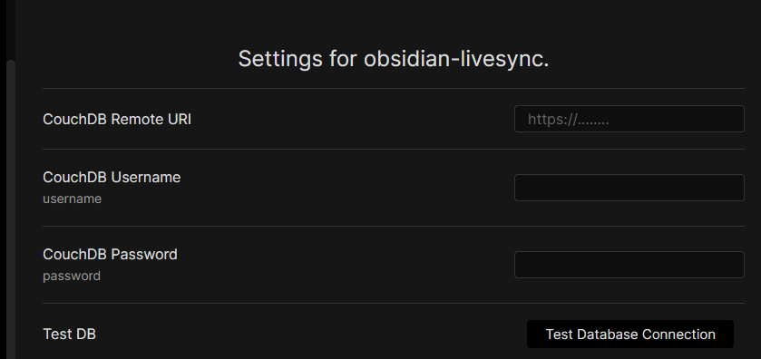

# obsidian-livesync

This is the obsidian plugin that enables livesync between multi-devices.  
Runs in Mac, Android, Windows, and iOS.

<!-- 
<video controls src="https://user-images.githubusercontent.com/45774780/137352386-a274736d-a38b-4069-ac41-759c73e36a23.mp4"  muted="false"></video>
 -->

**It's beta. Please make sure to back your vault up!**

Limitations: Folder deletion handling is not completed.

## This plugin enables..

-   Live Sync
-   Self-Hosted data synchronization with conflict detection and resolving in Obsidian.
-   Off-line sync is also available.

## IMPORTANT NOTICE

**Please make sure to disable other synchronize solutions to avoid content corruption or duplication.**
If you want to synchronize to both backend, sync one by one, please.

## How to use

1. Install from Obsidian, or clone this repo and run `npm run build` ,copy `main.js`, `styles.css` and `manifest.json` into `[your-vault]/.obsidian/plugins/` (PC, Mac and Android will work)
2. Enable obsidian livesync in the settings dialog.
3. If you use your self-hosted CouchDB, set your server's info.
4. or Use [IBM Cloudant](https://www.ibm.com/cloud/cloudant), take an account and enable **Cloudant** in [Catalog](https://cloud.ibm.com/catalog#services)  
   Note please choose "IAM and legacy credentials" for the Authentication method
   Setup details are in Couldant Setup Section.
5. Setup LiveSync or SyncOnSave or SyncOnStart as you like.

## When your database looks corrupted

obsidian-livesync changes data treatment of markdown files since 0.1.0  
When you are troubled with synchronization, **Please reset local and remote databases**.  
_Note: Without synchronization, your files won't be deleted._

1.  Disable any synchronizations on all devices.
2.  From the most reliable device(_The device_), back your vault up.
3.  Click "Reset local database" on all devices.
4.  From _The device_ click "Reset remote database".
5.  From _The device_ click "Init Database again".
6.  Enable any sync or Hit the Replication button.

And wait for a minute. your data will be uploaded and synchronized with all devices again.

## Cloudant Setup

### Creating an Instance

1. Hit the "Create Resource" button.
   

1. In IBM Cloud Catalog, search "Cloudant".
   

1. You can choose "Lite plan" for free.
   

Select Multitenant(it's the default) and the region as you like.
 3. Be sure to select "IAM and Legacy credentials" for "Authentication Method".

4. Select Lite and be sure to check the capacity.
   

5. And hit "Create" on the right panel.
   

6. When all of the above steps have been done, Open "Resource list" on the left pane. you can see the Cloudant instance in the "Service and software". Click it.
   

7. In resource details, there's information to connect from obsidian-livesync.
   Copy the "External Endpoint(preferred)" address. (\*1)
   

### CouchDB setup

1.  Hit the "Launch Dashboard" button, Cloudant dashboard will be shown.
    Yes, it's almost CouchDB's fauxton.  
    

1.  First, you have to enable the CORS option.
    Hit the Account menu and open the "CORS" tab.
    Initially, "Origin Domains" is set to "Restrict to specific domains"., so set to "All domains(\*)"  
    _NOTE: of course We want to set "app://obsidian.md" but it's not acceptable on Cloudant._
    

1.  And open the "Databases" tab and hit the "Create Database" button.
    Enter the name as you like (\*2) and Hit the "Create" button below.  
    

1.  If the database was shown with joyful messages, then you can close this browser tab now.  
    

### Credentials Setup

1.  Back into IBM Cloud, Open the "Service credentials". You'll get an empty list, hit the "New credential" button.
    

1.  The dialog to create a credential will be shown.
    type any name or leave it default, hit the "Add" button.  
      
    _NOTE: This "name" is not related to your username that uses in Obsidian-livesync._

1.  Back to "Service credentials", the new credential should be created.  
    open details.  
      
    The username and password pair is inside this JSON.  
    "username" and "password" are so.  
    follow the figure, it's
    "apikey-v2-2unu15184f7o8emr90xlqgkm2ncwhbltml6tgnjl9sd5"(\*3) and "c2c11651d75497fa3d3c486e4c8bdf27"(\*4)

### obsidian-livesync setting

example values.

| Items               | Value       | example                                                                     |
| ------------------- | ----------- | --------------------------------------------------------------------------- |
| CouchDB Remote URI: | (\*1)/(\*2) | https://xxxxxxxxxxxxxxxxx-bluemix.cloudantnosqldb.appdomain.cloud/sync-test |
| CouchDB Username    | (\*3)       | apikey-v2-2unu15184f7o8emr90xlqgkm2ncwhbltml6tgnjl9sd5                      |
| CouchDB Password    | (\*4)       | c2c11651d75497fa3d3c486e4c8bdf27                                            |

# License

The source code is licensed MIT.
