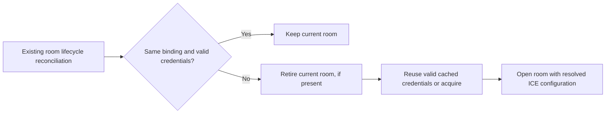

# TURN credential sources

## Purpose and decisions

This developer design addresses [Issue #1182](https://github.com/vrtmrz/obsidian-livesync/issues/1182)
through a service-independent interface for acquiring TURN credentials.
The [P2P transport compatibility ADR](../adr/2026_08_p2p_transport_compatibility.md)
records the accepted policy. The contract, lifecycle, settings, and host
integration are implemented locally. Real provider issuance, relay-only
Obsidian synchronisation, and synchronisation after explicit reconnection have
been verified. Expiry-driven TURN reconnection remains release validation work.

The design uses these decisions:

- Acquire credentials on the device through an optional service integration.
- Persist the user-supplied provider API token with the P2P profile and include
  it in encrypted Setup URI sharing for additional devices.
- Redact provider configuration and issued credentials from reports and logs.
- Keep issued short-lived credentials in memory only.
- Keep a local expiry alongside issued credentials and check it in the
  existing room reuse decision.
- When that decision finds expired credentials, acquire a new configuration
  and use the existing room replacement lifecycle. Replacement may cancel
  an in-progress transfer; the next replication attempt reuses stored progress.
- Check expiry when the room lifecycle is reconciled. Add no renewal timer,
  per-peer acquisition hook, `setConfiguration()`, or credential-driven ICE
  restart.

Manual TURN configuration remains supported without a provider account.
Cloudflare is the first optional integration. A separate credential endpoint,
a general authentication framework, runtime extension loading, and migration
of existing service integrations are outside the first delivery.

## Ownership and composition

An **ICE server source**, represented by `IceServerSource`, supplies ICE server
URLs, access credentials, and their expiry. This is developer vocabulary for
the acquisition contract; it is separate from a Replicator provider.

| Component | Responsibility | Owner |
| --- | --- | --- |
| Source contract | Acquisition result, validation, and safe failure categories | Commonlib |
| Credential state and room reuse | Memory cache, expiry check, acquisition, cancellation, and room replacement | Commonlib `P2PRoomSessionOwner` |
| Physical peer creation | Use the configuration supplied when joining the room | Existing Trystero implementation |
| Source catalogue and settings | Explicit source selection and host dependencies | LiveSync |
| Cloudflare source | Provider request, response conversion, and configuration validation | LiveSync `src/integrations/cloudflare/` |

Implementation placement:

```text
Commonlib
  P2P source contract and private credential cache
  Expiry check in the existing room owner and session construction

LiveSync
  src/integrations/iceServerSources.ts
  src/integrations/cloudflare/iceServerSource.ts
  src/integrations/cloudflare/settings.ts
  src/serviceFeatures/useIceServerSources.ts
```

`integrations/` groups code which connects external services to the common
contract. It does not imply a hosted project service or a public extension
marketplace. The service feature composes a closed catalogue of source
factories with explicit dependencies, following
[Service feature and legacy Module boundaries](service_feature_and_legacy_module_boundaries.md).
An integration receives neither `LiveSyncBaseCore` nor ownership of replication.

Supply the catalogue through an optional composition argument to
`useP2PReplicatorFeature`, preserving its manual-only default for existing
Commonlib consumers. Factories validate settings without network access;
acquisition runs only when requested by the P2P owner. Unsupported sources
produce an explicit configuration error.



## Settings and dependencies

Present a `TURN configuration` choice with `Manual` and `Cloudflare`.
The catalogue supplies each integration's label and fields; the common P2P
engine does not branch on a service name.

| Input | Manual | Cloudflare |
| --- | --- | --- |
| TURN server URLs | Existing field | Supplied by the API |
| TURN username and credential | Existing fields | Issued in memory |
| TURN Key ID | Unused | Required and persisted |
| TURN Key API Token | Unused | Required, masked in the dialogue, and persisted |

The first Cloudflare implementation requests a 24-hour lifetime internally.
It needs no account ID, email address, custom endpoint URL, or renewal interval
setting. This lifetime is a design default, not a provider default.

Dependencies are an injected HTTP operation, a clock, cancellation/deadline
handling, and the existing settings and P2P lifecycle services. No Cloudflare
SDK, credential broker, or new operating-system secret-store dependency is
required.

Retain `P2P_turnServers`, `P2P_turnUsername`, and `P2P_turnCredential` for manual
configuration. An absent source selection means manual. Add a versioned P2P
profile descriptor, `P2P_iceServerSource`:

```json
{
  "version": 1,
  "id": "cloudflare",
  "configuration": {
    "turnKeyId": "user-supplied-key-id",
    "apiToken": "user-supplied-turn-key-api-token"
  }
}
```

Commonlib owns the JSON envelope; each source owns validation of its
configuration. Unsupported identifiers and versions remain preserved in
storage and produce an explicit unsupported result when selected. Loading an
inactive profile performs no acquisition.

The selected source configuration, including token changes, participates in
the effective P2P configuration identity. Issued credentials and their expiry
are separate runtime state. Room reuse requires both a matching identity and
usable credentials. Under managed selection, unused manual credentials do
not affect that identity; manual selection preserves the existing projection.
Keep the identity opaque and absent from diagnostics. Apply source changes
and expired runtime credentials through the existing room replacement policy.

## Persistence, sharing, and redaction

The API token is an ordinary sensitive connection setting. Persist it with
the profile so that restarting a device and configuring another device do
not require re-entry. This does not claim operating-system keychain storage.
When optional configuration encryption is enabled, cover both the saved
profile URI and any top-level settings projection containing the source.
Failure to encrypt either copy must leave the prior saved settings intact
and report a safe error; it must not silently save a plaintext replacement.

| Destination | Provider API token | Issued TURN username and credential |
| --- | --- | --- |
| Saved P2P profile | Included | Omitted |
| Encrypted Setup URI | Included with the source and Key ID | Omitted |
| Runtime room configuration | Available only to the source | Cached in memory and passed to WebRTC |
| General report or diagnostic log | Redacted | Redacted |

Encrypted Setup URI sharing is the complete sharing route for managed
profiles. Preserve the independent main-remote and P2P selections and the
receiving device's own peer name. Raw profile and unencrypted QR copy actions
should offer encrypted Setup URI sharing when their output includes a managed
source, including one in an inactive profile. Never substitute a temporary
TURN password or silently export a profile missing its API token.

Markdown settings export must not leak tokens through either the top-level
source or a profile URI. For this first delivery, omit the profile collection,
its selections, and the source projection together when managed profiles are
present, and explain that connection sharing uses the encrypted Setup URI.
Importing Markdown without that group preserves the local profiles and
selections rather than replacing them with a filtered collection.

Reports expose only safe source labels and acquisition state. Redact the
entire opaque source configuration, including unknown source configurations,
and every stored or projected copy. Preserve the existing scheme-only
redaction of profile URIs in `src/common/reportTool.ts`. Do not log request
headers, raw API bodies, source identity values, or HTTP errors which embed
credentials. Use one redaction policy across report and diagnostic paths;
cover inactive profiles and encoded values in tests.

## Acquisition contract

Commonlib exports the acquisition contract from `/p2p`:

```typescript
type IceServerConfiguration = {
    iceServers: readonly RTCIceServer[];
    expiresAt: number | null;
};

declare class IceServerSourceError extends Error {
    constructor(
        code: "configuration" | "authentication" | "unavailable" | "invalid-response",
        message: string,
        retryable: boolean
    );
}

interface IceServerSource {
    acquire(signal: AbortSignal): Promise<IceServerConfiguration>;
}
```

`expiresAt` is a local Unix timestamp in milliseconds. `null` represents
non-expiring manual configuration; managed results require a finite expiry.
Sources throw a typed, safe failure or propagate cancellation. The room owner
calls the same operation when it needs an initial or replacement credential
set. A source does not save settings, schedule renewal, mutate peers, or
start replication.

Validate supported `stun:`, `stuns:`, `turn:`, and `turns:` URLs, complete TURN
credentials, bounded response size and entry count, and enough remaining
lifetime for connection establishment. A managed TURN source must return at
least one usable TURN entry. Copy the validated result before handing it to
WebRTC; unknown fields never become arbitrary `RTCConfiguration` options.
Preserve ordinary STUN behaviour and the selected connection-path policy.

### Cloudflare request

The source calls the fixed provider API:

```http
POST https://rtc.live.cloudflare.com/v1/turn/keys/{TURN_KEY_ID}/credentials/generate-ice-servers
Authorization: Bearer {TURN_KEY_API_TOKEN}
Content-Type: application/json

{"ttl":86400}
```

Cloudflare returns an `iceServers` array. Its documented maximum lifetime is
48 hours, and the returned ICE server structure has no TTL. Derive the local
expiry from the requested TTL and the time before the request started,
allowing for request duration and a connection-establishment margin. Reject a
response which has already become too old. See
[credential generation](https://developers.cloudflare.com/realtime/turn/generate-credentials/)
and [the TURN FAQ](https://developers.cloudflare.com/realtime/turn/faq/).

Only the Key ID, API token, and requested lifetime go to the provider. The
source has no need for a Vault passphrase, Group ID, peer name, or file data.
Use a TURN Key API Token, not an account-wide API key. Cloudflare documents a
server-side secret model; this design explicitly permits users to place and
share their own issuance token on their participating devices. Whoever
receives that token can issue credentials under its authority.

All maintained hosts inject `API.webCompatFetch`, using standard fetch
cancellation and redirect controls. The source refuses redirects, omits cookies,
requests `no-store`, and applies a 15-second deadline. It bounds the response to
32 KiB, 16 ICE entries, and 32 URLs. Commonlib independently validates the
result and requires at least 30 seconds of remaining lifetime before use.

A read-only CORS preflight on 15 September 2026 returned HTTP 204 and allowed
POST, `Authorization`, and `Content-Type` from the requested origin. This
establishes preflight support, not successful authenticated issuance. Obsidian's
`nativeFetch` adapter is not used here because its `requestUrl` path does not
forward all required fetch controls. Provider HTTP behaviour is covered by
fixtures; operator-owned credentials are still required for real issuance and
TURN allocation validation.

## Room reuse and credential expiry

### Runtime state and decision

Keep one private cached result for the effective source configuration in the
P2P room owner. It contains the validated ICE servers, `expiresAt`, and the
source identity which produced them. Reuse it while that source still matches
and its remaining lifetime is sufficient. Clear it on source change, explicit
disconnect, suspension, or owner disposal. Neither the credentials nor the
expiry becomes a persisted setting.

`expiresAt` is derived from issuance time and the requested TTL. A fixed TTL
value alone cannot identify whether an earlier issuance has expired. Keep the
expiry check separate from the stable settings signature rather than making
wall-clock time an ordinary configuration field.

The existing `reconcileTransport()` reuse decision becomes conceptually:

```typescript
const reusable =
    current?.host.isServing &&
    bindingsMatch(activeBinding, desiredBinding) &&
    credentialsRemainUsable(activeCredentials, now);
```

Manual configuration has no managed expiry and preserves the existing
behaviour. For a managed source, a missing or expired result makes the room
ineligible for reuse even if the saved settings have not changed.

When reuse is unavailable, use the existing lifecycle queue:

1. Retire the current session, if present. Its cancellation and settlement
   path also handles any in-progress transfers.
2. Resolve valid cached credentials for the desired source, or await a new
   `acquire()` result. Serialised reconciliation shares this work rather than
   issuing a request for each physical peer.
3. Construct the replacement session with a temporary, resolved ICE
   configuration. Keep that configuration separate from persisted manual
   fields and the settings projection used for policy changes.
4. Before publishing the session, recheck the source identity, expiry,
   enabled state, and room demand. Discard obsolete results and candidates.

Acquisition and room opening have bounded deadlines. A result which expires
before publication is unusable. Each reconciliation makes one acquisition
attempt; a later explicit retry or existing reconciliation can try again. A credential test uses its own result and does not replace
the active room's cache.

### When the check runs

Use existing reconciliation opportunities, including explicit connection,
changes to room demand, and applicable settings/lifecycle events. Time passing
alone does not run reconciliation or close a room. If reconciliation runs
after expiry, ordinary replacement may interrupt a transfer; no additional
idle wait or transfer-preservation mechanism is required.

Not every operation passes this decision. A transfer admitted directly by an
existing session, a signalling WebSocket reconnect, and Trystero's internal
physical-peer reconnection can proceed without owner reconciliation. This
scope checks credential validity during room reconciliation and acquires a
new set when needed. Individual physical connection attempts use the room's
existing configuration.
A room which remains open beyond expiry may require an explicit reconnect
before new TURN-dependent peers can connect.

### Existing transport boundary

The inspected baseline is Commonlib `0.1.24` and Trystero `0.25.3`, as pinned
in the LiveSync lockfile:

| Package boundary | Relevant behaviour |
| --- | --- |
| Commonlib `P2PRoomSessionOwner.reconcileTransport()` | Reuses an equivalent serving room; otherwise retires it and constructs another session. |
| Commonlib `P2PRoomSession.retire()` | Rejects new work, cancels current finite operations, waits for settlement, and disposes the room. |
| Commonlib `TrysteroReplicatorP2PServer.start()` | Supplies resolved options to Trystero when joining the room. |
| Trystero `dist/strategy.mjs` and `dist/offer-pool.mjs` | The final room leave destroys the outgoing offer pool; a later join can use new options. |
| Trystero `dist/shared-peer.mjs` | Live physical peers may survive logical room leave/rejoin under Trystero ownership. |

Use the normal retire-before-open path. LiveSync does not close raw peers or
create another transport generation. The design requires no Trystero peer
factory extension, eager-pool change, or existing-peer configuration update.
Verify fresh TURN allocation after normal room replacement in the maintained
host topology; a still-connected shared peer can remain usable and is not
proof that a fresh allocation used the new credentials. This assumes one
active P2P room per host; pool replacement while another room remains open
needs separate validation.

### Replication after interruption

Commonlib `0.1.24` uses `replicateShim()` for P2P transfer. Its checkpoint is
stored in database-local documents, using the source and destination database
names and a source-side marker. The Trystero peer ID is not the checkpoint
identity. Rejoining the same databases with a new peer ID therefore retains
replication progress.

For each batch, the shim reads changes, compares destination revisions with
`revsDiff`, fetches missing revisions, writes them with `new_edits: false`,
and invokes the processing callback before advancing the checkpoint. Room
retirement does not delete the database documents or replication checkpoints.

Consequently, the next replication attempt starts at the last committed
checkpoint. If interruption or a lost response leaves writes beyond that
checkpoint, it may scan that batch again; revision comparison avoids fetching
already stored revisions again. Missing or incomplete document revisions are
retried. This preserves received Metadata and Chunks, but does not resume a
partially received network message at its last byte. Normal P2P calls use
`rewind: false`; database replacement, removed checkpoint state, or an explicit
rewind can require an earlier scan.

Starting that next attempt follows existing synchronisation policy. An
unfinished AutoSync baseline remains eligible when an accepted matching peer
is advertised again: `P2PAutomationCoordinator` only records completed
baselines. A cancelled manual transfer does not automatically restart merely
because the room reconnects; the next requested synchronisation uses the
same stored progress. This feature adds no universal transfer retry loop and
does not report a cancelled attempt as successful.

A focused check executed the pinned `ReplicatorShim.js` with in-memory
database boundaries and confirmed both cancellation after a committed batch
and loss of completion after writes but before the checkpoint. Both subsequent
attempts fetched only missing revisions. The pinned automation coordinator
also allowed another attempt after a cancelled baseline. These checks verify
the algorithms; they do not establish real WebRTC reconnection or file
reflection behaviour, which remains part of implementation validation.

### Failure and cancellation

Acquisition failure leaves the attempted room opening unavailable and reports
a safe, actionable state. Do not fall back to saved manual credentials,
choose another provider, or relax relay-only mode. Authentication and
configuration errors wait for correction or an explicit retry. Transient
failures are marked retryable for the existing lifecycle or an explicit retry;
this source adds no automatic acquisition or reconnect loop.

Explicit disconnect, source changes, and application suspension invalidate
pending acquisition. A late HTTP result cannot publish a room or restore an
obsolete source. Cancellation must take effect while room opening awaits
acquisition rather than waiting behind it in the lifecycle queue. The owner
rechecks current demand and configuration before exposing a replacement.

## Compatibility and verification

### Stored settings and sharing formats

Update Commonlib's P2P setting type, `pickP2PSyncSettings`, connection-string
parser, Setup URI processing, and settings encryption together. Update the
LiveSync Setup dialogue, import handler, profile export, Markdown settings,
and report paths. Existing fixed-field serialisers would otherwise discard
the source. Generated credentials never populate the manual fields.

Managed profile strings need a distinguishable format,
`sls+p2p-v2://`. Commonlib `0.1.24` rejects that scheme, whereas it silently
drops unknown fields in ordinary `sls+p2p://` strings. Manual profiles retain
their current format. Validate the source before activation; unknown sources
must not become manual connections.

Full encrypted Setup URIs also need a distinguishable outer format,
`obsidian://setuplivesync-v2?settings=`, and a versioned encrypted
envelope when managed profiles are included. The old import path decrypts and
merges arbitrary JSON, so a nested profile version alone is insufficient.
Validate the new envelope before applying settings in every maintained host.
Apply stored settings schema checks on load and import, including downgrades;
older clients must not activate a managed profile after dropping its source.
Document any minimum-client and downgrade requirements with the implementation.

For a selected managed source, save the complete P2P connection in its
versioned profile and disable the persisted legacy P2P projection: clear its
Group ID and passphrase, and save `P2P_Enabled` and `P2P_AutoStart` as false.
A compatible client restores those runtime values from the selected profile.
This prevents an older client which rejects the profile URI from connecting
through leftover manual fields. Source-only settings without a configured
room can remain disabled until setup is complete. The live settings and
setting-saved notifications retain their usable runtime values. A selected
manual profile retains its established persisted representation, even when
another saved profile has a managed source.

The P2P data protocol and Group ID remain unchanged. A peer using manually
configured TURN can communicate with one using issued credentials; validate
that interoperability without requiring both peers to use the same issuer.

### Real-provider verification

On 15 September 2026, the local LiveSync build with Commonlib
`0.1.25-dev.turn-credentials.3` passed a real Cloudflare TURN check in two
isolated Obsidian 1.12.7 instances on one Linux host. Both instances used the
Cloudflare source and `P2P_connectionPath: "relay"`, with a local Nostr relay
used only for signalling.

- The source received HTTP 201 responses and acquired credentials with a
  requested 24-hour lifetime. The Obsidian instances also received successful
  issuance responses through their own HTTP integration.
- Both endpoints reported selected local and remote candidates of type
  `relay`, using UDP, before transferring a note. The receiving Vault contained
  the expected note content after replication completed.
- Explicitly disconnecting one instance removed its peer advertisement from
  the other. Reconnecting issued credentials again and established a new
  relay-only connection. A second note then travelled in the reverse direction
  and appeared with the expected content in the receiving Vault.

This check covers initial provider issuance, real relayed replication, and
credential reacquisition after an explicit disconnect. It does not establish
natural TTL expiry, interruption within a replication batch, mobile operating
system behaviour, mixed manual/managed peers, or connectivity between different
networks. Those cases retain their separate validation requirements. The
results contain no provider token, TURN username, or TURN credential.

### Acceptance criteria for implementation

- Manual configuration, default STUN, and existing Setup URIs retain their
  behaviour. Unsupported managed sources fail explicitly.
- Provider tokens survive restart, profile selection, optional configuration
  encryption, and encrypted Setup URI sharing. Reports and logs reveal no
  tokens or issued credentials, including inactive and encoded copies.
- Issued credentials never enter persisted settings, exports, or reports.
- Equivalent settings and valid credentials reuse the room. Expired
  credentials cause the next owner reconciliation to acquire and replace
  through the existing lifecycle; manual settings retain their behaviour.
- Concurrent reconciliation does not duplicate acquisition. Late responses
  after disconnect, source change, or suspension cannot publish a room.
  Expiry tests cover delayed responses and clock changes.
- Time passing alone triggers no acquisition or replacement. There is no
  per-peer acquisition hook, `setConfiguration()`, or credential-driven ICE
  restart.
- Replacement during a batch settles the old attempt and preserves stored
  documents and checkpoints. The next attempt transfers missing revisions;
  test interrupted AutoSync and explicit manual retry separately.
- Safe failures cover authentication, rate limits, network errors, timeouts,
  and malformed responses without an automatic source or route-policy change.
- Real relay-only connections verify initial establishment and room
  replacement after expiry, including mixed manual/managed peers and both
  initiator roles. A selected relayed candidate pair is required evidence;
  direct traffic alone does not validate TURN use.
- Real Obsidian checks cover HTTP behaviour, desktop/mobile lifecycle,
  persistence/sharing, and a file round trip after reconnection. Validate
  supported CLI/browser hosts before enabling their direct integration.

The existing Setup connection check remains a signalling check. Credential
issuance, a disposable TURN allocation check, actual peer data transfer, and
LiveSync file synchronisation establish different facts. Tests and status
must identify which boundary they verify.

Implement the Commonlib contract, settings, runtime expiry, and existing room
replacement integration in its own repository. Validate the packed Commonlib
artefact before updating LiveSync's exact dependency and composing the
Cloudflare source. Use deterministic provider fixtures and an open-source
Coturn test service for repeatable
coverage; verify the real provider path with operator-owned test credentials.

Run Commonlib checks, LiveSync `npm run check`, unit tests, builds, and focused
consumer tests for the implementation. Deterministic source, lifecycle, persistence, sharing, and redaction tests
cover the implemented boundaries. Real provider allocation and host
reconnection evidence must be recorded separately before release.
