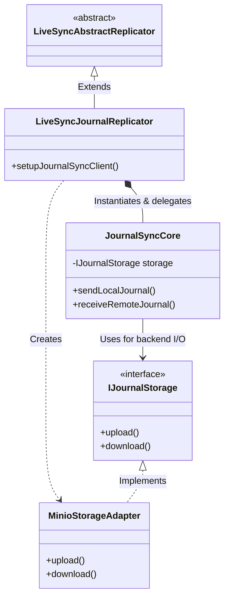

## The design document of the Journal Replicator 2nd Edition

### Goal
- Build a robust and memory-efficient replication foundation that decouples the physical storage layer by leveraging the Web Streams API.
- Maintain strict compliance with the data consistency and replication protocols of CouchDB/PouchDB.
- Introduce the `IJournalStorage` abstraction to ensure easy extensibility. This allows the core to seamlessly interact with Object Storages (MinIO, S3, R2, etc.) while opening the door for entirely new Storage Engines and Mocks for testing.

### Motivation
- The original Journal Replicator used a custom queue mechanism called `Trench` to manage backpressure, which had limitations regarding memory efficiency when dealing with a massive number of files.
- The storage operation logic was tightly coupled with `JournalSyncAbstract`, making it difficult to swap out the physical storage layer (e.g., S3 and WebDAV).
- The transfer of revision trees (`_revisions`) conforming to PouchDB's replication protocol was implicitly managed. There was a need for a stricter, more deterministic application of document histories.

### Differences from v1 (Original)

The overall architecture and mechanisms have been drastically modernised from the first version. Here are the key differences:

| Feature / Mechanism | v1 (Original) | v2 (2nd Edition) | Key Benefits in v2 |
| :--- | :--- | :--- | :--- |
| **Backpressure / Queueing** | Custom `Trench` mechanism | Native **Web Streams API** | Prevents memory exhaustion during massive transfers; extremely stable sustained throughput. |
| **Storage Architecture** | Tightly coupled in `JournalSyncAbstract` | Abstracted via **`IJournalStorage`** | Easy to plug in new Storage Engines (WebDAV, etc.) and testing Mocks without altering the core logic. |
| **Document Application** | Sometimes evaluated as new local edits | Strict `bulkDocs` with **`new_edits: false`** | Drastically faster insertions; prevents redundant conflict branches and "echo" network traffic. |

#### Class Structure Changes (Diff from v1)

Looking at the Git diff from the `main` branch, the class structure has undergone a significant refactoring to achieve the aforementioned decoupling:

- **`JournalSyncAbstract.ts` -> `JournalSyncCore.ts`**: The core logic was renamed. Instead of being an abstract base class for specific storages, it is now a concrete core class that manages the Web Streams API pipelines.
- **`JournalSyncMinio.ts` -> `MinioStorageAdapter.ts`**: The MinIO-specific implementation was decoupled from the core logic and converted into a dedicated storage adapter.
- **`IJournalStorage` (New)**: Introduced in `JournalStorageAdapter.ts` to define the interface that all storage adapters must implement.

### Methods and implementations

#### Pipeline Construction using Web Streams API
We replaced `Trench` with standard Web Streams APIs (`ReadableStream`, `TransformStream`, and `WritableStream`) to build the sending and receiving pipelines.
- **Sending Pipeline**: Reads documents from the PouchDB changes stream, passes them through a compression `TransformStream`, and pipes them to an upload `WritableStream`. This enables automatic backpressure, keeping memory consumption stable even during large-scale synchronisation.
- **Receiving Pipeline**: Processes storage file listing, downloading/decompression, and bulk application to PouchDB in a streamlined manner.

#### Decoupling the Physical Layer via IJournalStorage
To detach the storage operations from the core synchronisation logic (`JournalSyncCore`), we introduced the `IJournalStorage` interface.
This ensures extensibility not only to Object Storages (MinIO, S3, R2, etc., handled via `MinioStorageAdapter` and Connection Strings) but also to entirely new Storage Engines (e.g., WebDAV, Google Drive) and Mocks for testing. When adding a new backend, developers only need to add an Adapter that implements this interface, without modifying the core replicator.

#### Strict Application of PouchDB Replication Protocols
To synchronise precisely according to the CouchDB/PouchDB protocol, the following steps were optimised:
1. **Transferring History**: Using `bulkGet({ revs: true })`, the replicator transfers not only the latest revision of a document but its entire history tree (`_revisions`) alongside the deletion flag (`_deleted`).
2. **Applying History**: On the receiving end, the replicator uses `revsDiff` to identify which incoming revisions are missing locally. It then applies them using `bulkDocs(saveDocs, { new_edits: false })`.
By specifying `new_edits: false`, PouchDB integrates the received history exactly as it is without treating them as new local edits. This prevents unexpected conflicts and redundant branching of the revision tree.

### Performance and Speed Characteristics

By migrating from the previous `Trench` architecture to the Web Streams API and strict PouchDB protocol compliance, the replication speed characteristics have changed in the following ways:

1. **On-Demand Generation and Consistent Throughput**:
   In the previous `Trench` architecture, the system would eagerly generate or download all 'Changes' in bulk before processing them. This batch processing became a significant bottleneck and caused massive memory spikes (Even though, some of them have been stored into the idb temporally). The Web Streams API fundamentally shifts this to **on-demand (lazy) generation**. Data is pulled and processed only as much as the next pipeline stage (Compress -> Upload/Write) can handle. While this on-demand approach might appear slightly slower in terms of peak burst speed compared to in-memory batching, it completely eliminates the 'create-everything-at-once' bottleneck. This makes the **sustained throughput far more stable** and prevents out-of-memory crashes on mobile devices.

2. **Faster Receive-Side Application (`new_edits: false`)**:
   In the previous version, incoming documents were sometimes evaluated as new local edits. By utilising PouchDB's `bulkDocs({ new_edits: false })` alongside the proper `_revisions` tree, we bypass unnecessary conflict generation and local revision hashing. This drastically **speeds up the document insertion process** on the receiving end.

3. **Optimised Network Traffic**:
   Because conflicts are resolved deterministically and revision trees are replicated exactly as they exist, the system avoids generating 'echoes' (redundant synchronisations triggered by a device misunderstanding a history tree). This reduces unnecessary background traffic significantly.

### Consideration and Conclusion
The Journal Replicator 2nd Edition achieves robust and scalable storage synchronisation through enhanced memory efficiency (via Web Streams), decoupled extensibility (via IJournalStorage), and strict protocol compliance (via `new_edits: false`).
Moving forward, this foundation will make it much easier to officially support a wider variety of backend storages.
