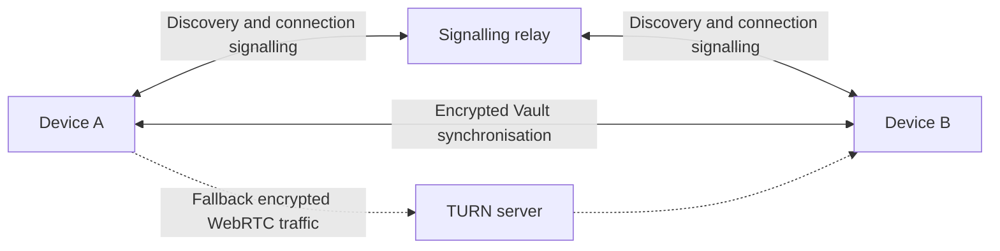
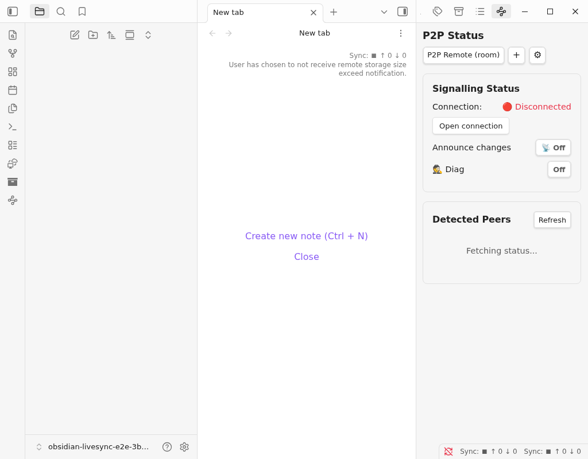
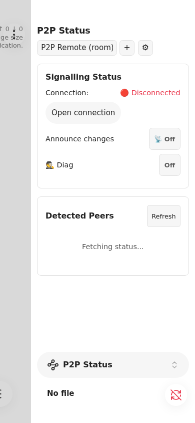
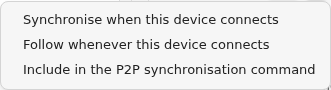

# How peer-to-peer synchronisation works

Peer-to-peer (P2P) synchronisation transfers Vault data between LiveSync devices through WebRTC. It does not require a central database containing a copy of the Vault. It does require a signalling relay so that devices can discover one another and establish a connection.

For the procedure for the first and additional devices, see [Set up peer-to-peer synchronisation](setup_p2p.md). For connection problems, see [Peer-to-Peer Synchronisation Tips](tips/p2p-sync-tips.md).

## Connection model

The signalling relay and TURN server have different roles:

- The **signalling relay** is required for peer discovery and connection negotiation. LiveSync uses Nostr-compatible WebSocket relays for this role. The relay does not store or transfer Vault contents.
- A **TURN server** is an optional fallback. WebRTC uses it to relay the encrypted peer connection only when the devices cannot establish a direct path through their networks.

## The project's public signalling relay

The project author operates a public signalling relay as a best-effort convenience. Selecting **Use the project's public signalling relay** means that no signalling server needs to be provisioned for an ordinary setup.

The public relay:

- is not a Vault storage service;
- may observe signalling metadata, such as connection timing and network addresses;
- has no availability or log-retention guarantee; and
- can be replaced with another compatible relay at any time by updating every device in the P2P group.

Use a signalling relay which is acceptable for your privacy and availability requirements. A controlled deployment may use its own Nostr-compatible relay.

## Signalling relay and TURN server

Both settings contain server addresses, but they are not interchangeable.

| Setting | Required | Carries Vault contents | Purpose |
| --- | --- | --- | --- |
| **Signalling relay URLs** | Yes | No | Finds peers and exchanges the information needed to establish WebRTC connections. |
| **TURN server URLs** | Only when direct WebRTC connectivity fails | Encrypted WebRTC traffic | Relays traffic between peers when NAT or firewall rules prevent a direct path. |

A TURN provider cannot read LiveSync's encrypted Vault contents, but it can observe connection metadata and traffic volume. Use a provider you trust. The project does not operate an official TURN service.

## P2P Status

The **P2P Status** pane is the current Obsidian interface for P2P connections.

- After a P2P configuration exists, the command **Self-hosted LiveSync: P2P Sync : Open P2P Status** is available from the command palette.
- The P2P ribbon icon appears only after a P2P configuration exists.
- LiveSync does not open the pane merely because Obsidian has started. If the pane was already part of the saved Obsidian workspace, Obsidian may restore it.
- Workspaces containing the retired P2P pane are migrated to the current status pane. The retired command is no longer exposed.

The active P2P remote is selected independently from the main CouchDB or Object Storage remote. Devices can therefore use P2P alongside their main remote without replacing it.

**Open connection** joins the signalling room and makes the device available for discovery. **Disconnect** leaves the LiveSync room, stops its P2P replication service, and closes the signalling connections. It does not delete the saved P2P profile.

Every participating device must use the same signalling relay set, Group ID, and P2P passphrase. Each device should have a distinct device name. A peer which joins after another device is already connected is advertised to that device; use **Refresh**, or reconnect the device which should be discovered, if a peer is not yet listed.

## Manual and automatic data movement

**Replicate now** performs an explicit bidirectional synchronisation with the selected peer. This is the clearest option when proving a new configuration.

**Announce changes** and **Follow changes** provide a more continuous experience:

- The source device must enable **Announce changes** before it dispatches change notifications.
- A receiving device must enable **Follow changes** for that peer before it fetches in response to those notifications.
- A notification contains no Vault data. It only asks the following peer to fetch through the encrypted P2P connection.
- Missing a notification does not make an explicit later synchronisation unsafe; **Replicate now** still compares the available data.

The peer's **More actions** menu can save these choices for that device:

- **Synchronise when this device connects** runs one synchronisation when that named peer is discovered.
- **Follow whenever this device connects** restores following for that named peer.
- **Include in the P2P synchronisation command** includes that peer when the command for registered targets is run.

Configure these only after a manual round trip has succeeded. Device names used by persistent rules should remain unique and stable.

## Approval and privacy

A device must approve a peer before serving its data. Permanent approval is stored; session approval lasts only for the current Obsidian session. Check the displayed device name before approving a request.

The encrypted Setup URI contains the shared P2P configuration but deliberately omits the device-specific name. Store the Setup URI and its passphrase separately, and generate a Setup URI for another device from a first device which has completed setup.

## Operational limits

- At least one device which already has the required data must be online while another device fetches it.
- P2P does not provide the continuously available central copy offered by CouchDB or Object Storage. Keep independent backups.
- Mobile operating systems may pause Obsidian in the background. Keep Obsidian visible and the device awake during initial transfer, rebuild, or a large synchronisation.
- Changing from CouchDB to P2P is not a repair operation for a stopped CouchDB setup. Diagnose the existing transport first.
