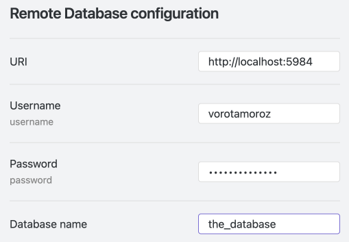
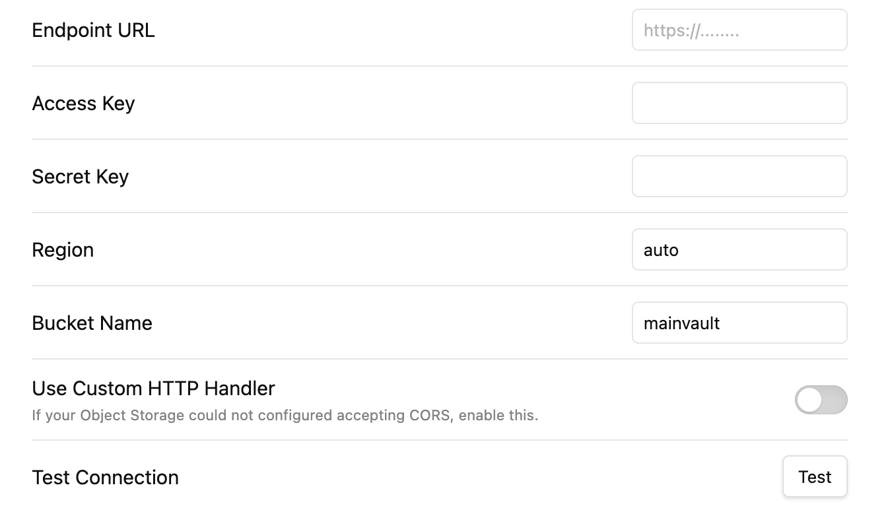
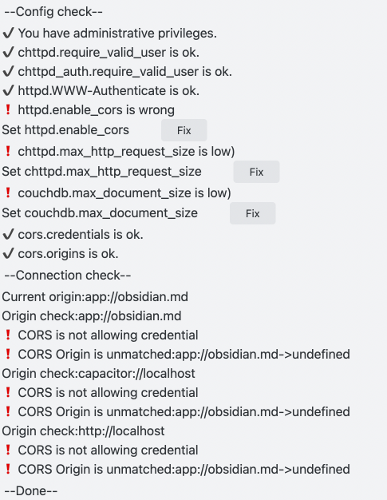
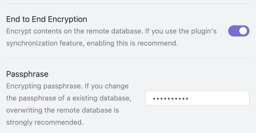
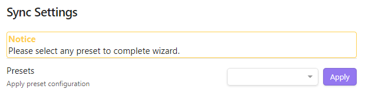
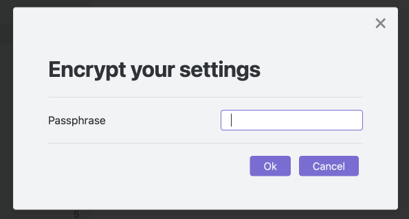

# Quick setup

[Japanese docs](./quick_setup_ja.md) - [Chinese docs](./quick_setup_cn.md).

The plugin has so many configuration options to deal with different circumstances. However, only a few settings are required in the normal cases. Therefore, `The Setup wizard` has been implemented to simplify the setup.

There are three methods to set up Self-hosted LiveSync.

1. [Using setup URIs](#1-using-setup-uris) *(Recommended)*
2. [Minimal setup](#2-minimal-setup)
3. [Full manually setup the and Enable on this dialogue](#3-manually-setup)

## At the first device

### 1. Using setup URIs

> [!TIP]
> What is the setup URI? Why is it required?  
> The setup URI is the encrypted representation of Self-hosted LiveSync configuration as a URI. This starts `obsidian://setuplivesync?settings=`. This is encrypted with a passphrase, so that it can be shared relatively securely between devices. It is a bit long, but it is one line. This allows a series of settings to be set at once without any inconsistencies. 
> 
> If you have configured the remote database by [Automated setup on Fly.io](./setup_flyio.md#a-very-automated-setup) or [set up your server with the tool](./setup_own_server.md#1-generate-the-setup-uri-on-a-desktop-device-or-server), **you should have one of them** 

In this procedure, [this video](https://youtu.be/7sa_I1832Xc?t=146) may help us.

1. Click `Use` button (Or launch `Use the copied setup URI` from Command palette).
2. Paste the Setup URI into the dialogue
3. Type the passphrase of the Setup URI
4. Answer `yes` for `Importing LiveSync's conf, OK?`.
5. Answer `Set it up as secondary or subsequent device` for `How would you like to set it up?`.
6. Initialisation will begin, please hold a while.
7. You will asked about the hidden file synchronisation, answer as you like.
   1. If you are new to Self-hosted LiveSync, we can configure it later so leave it once.
8. Synchronisation has been started! `Reload app without saving` is recommended after the indicators of Self-hosted LiveSync disappear.

OK, we can proceed the [next step](#).

### 2. Minimal setup

If you do not have any setup URI, Press the `start` button. The setting dialogue turns into the wizard mode and will display only minimal items.

>[!TIP]
> We can generate the setup URI with the tool in any time. Please use [this tool](./setup_own_server.md#1-generate-the-setup-uri-on-a-desktop-device-or-server).

#### Select the remote type

1. Select the Remote Type from dropdown list.
We now have a choice between CouchDB (and its compatibles) and object storage (MinIO, S3, R2). CouchDB is the first choice and is also recommended. And supporting Object Storage is an experimental feature.

#### Remote configuration 

##### CouchDB

Enter the information for the database we have set up.

  

##### Object Storage

1. Enter the information for the S3 API and bucket.

  

Note 1: if you use S3, you can leave the Endpoint URL empty.
Note 2: if your Object Storage cannot configure the CORS setting fully, you may able to connect to the server by enabling the `Use Custom HTTP Handler` toggle.

2. Press `Test` of `Test Connection` once and ensure you can connect to the Object Storage.

#### Only CouchDB: Test database connection and Check database configuration

We can check the connectivity to the database, and the database settings.

  

#### Only CouchDB: Check and Fix database configuration

Check the database settings and fix any problems on the spot.

This item may vary depending on the connection. In the above case, press all three Fix buttons.  
If the Fix buttons disappear and all become check marks, we are done.

#### Confidentiality configuration (Optional but very preferred)

Enable End-to-end encryption and the contents of your notes will be encrypted at the moment it leaves the device. We strongly recommend enabling it. And `Path Obfuscation` also obfuscates filenames. Now stable and recommended.

These setting can be disabled if you are inside a closed network and it is clear that you will not be accessed by third parties.

> [!TIP]
> Encryption is based on 256-bit AES-GCM.  

We should proceed to the Next step.

#### Sync Settings
Finally, finish the wizard by selecting a preset for synchronisation.

Note: If you are going to use Object Storage, you cannot select `LiveSync`.

Select any synchronisation methods we want to use and `Apply`. If database initialisation is required, it will be performed at this time. When `All done!` is displayed, we are ready to synchronise.

The dialogue of `Copy settings as a new setup URI` will be open automatically. Please input a passphrase to encrypt the new `Setup URI`. (This passphrase is to encrypt the setup URI, not the vault).

The Setup URI will be copied to the clipboard, please make a note(Not in Obsidian) of this.

>[!TIP]
We can copy this in any time by `Copy current settings as a new setup URI`.

### 3. Manually setup

It is strongly recommended to perform a "minimal set-up" first and set up the other contents after making sure has been synchronised.

However, if you have some specific reasons to configure it manually, please click the `Enable` button of `Enable LiveSync on this device as the set-up was completed manually`.
And, please copy the setup URI by `Copy current settings as a new setup URI` and make a note(Not in Obsidian) of this.

## At the subsequent device
After installing Self-hosted LiveSync on the first device, we should have a setup URI. **The first choice is to use it**. Please share it with the device you want to setup.

It is completely same as [Using setup URIs on the first device](#1-using-setup-uris). Please refer it.
