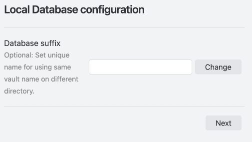
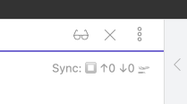

# Quick setup
The Setup wizard has been implemented since v0.15.0 simplifying the initial setup.

Note: Subsequent devices should be set up using the `Copy setup URI` and `Open setup URI` functionality.

## How to open and use the wizard
Open the `🪄 Setup wizard` in the settings dialogue. If the plugin has not been configured before, it should already be open.

### Discard the existing configuration and set up
If you have changed any settings, this button allows you to discard all changes before setting up.

### Do not discard the existing configuration and set up
Simply reconfigure. Be careful. In wizard mode, you cannot see all configuration items, even if they have been configured.

Pressing `Next` on one of the above options will put the configuration dialog into wizard mode.

### Wizard mode

Let's see how to use it step-by-step.

## Remote Database configuration

### Remote database configuration 

Enter the information for the database we have set up.  

  

### End to End Encryption

When End to End encryption is enabled, a third party will be less likely to be able to read your Remote database in the event of a data breach/leak (assuming they do not know the Passphrase). We strongly recommend enabling it.  
Encryption is based on 256-bit AES-GCM.  
This setting can be disabled if you are inside a closed network and it is clear that you will not be accessed by third parties.

### Test database connection and Check database configuration

Here we can check the status of the connection to the database and the database settings.  

  

#### Test Database Connection
Check whether we can connect to the database. If it fails, there are several possible reasons, but first attempt the `Check database configuration` check to see if it fails there too.

#### Check database configuration

Check the database settings and fix any deficiencies on the spot.

This item may vary depending on the connection. In the above case, press all three Fix buttons.  
If the Fix buttons disappear and all become check marks, we are done.

### Next 
Go to the Local Database configuration.

### Discard existing database and proceed
Discard the contents of the Remote database and go to the Local Database configuration.

## Local Database configuration

Configure the local database. If we already have a Vault with Self-hosted LiveSync installed which has the same directory name as the one we are currently setting up, please specify a different suffix than the Vault you have already set up here.

## Miscellaneous
Finally, finish the miscellaneous configurations and select a preset for synchronisation.

The `Show status inside editor` can be enabled to your liking. If enabled, the status is displayed in the top right-hand corner of the editor. Learn how to read the status bar [here](/README.md#information-in-statusbar).

From Presets, select the synchronisation method we want to use and `Apply` to initialise and build the local and remote databases as required.  
If `All done!' is displayed, we are done. Automatically, `Copy setup URI` will open and we will be asked for a passphrase to encrypt the `Setup URI`.

Set the passphrase as you like.  
The Setup URI will be copied to the clipboard, which you can then transfer to the second and subsequent devices in some way.

# How to set up the second and subsequent units
After installing Self-hosted LiveSync on the first device, select `Open setup URI` from the command palette and enter the setup URI you transferred. Afterwards, enter your passphrase and a setup wizard will open.  
Answer the following.

- `Yes` to `Importing LiveSync's conf, OK?`
- `Set it up as secondary or subsequent device` to `How would you like to set it up?`.

Then, The configuration will take effect and replication will start. Your files will be synchronised soon! You may need to close the settings dialog and reopen it to see the settings fields populated properly, but they will be set.
