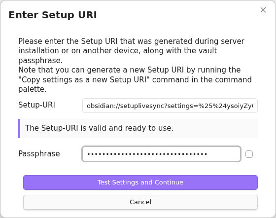
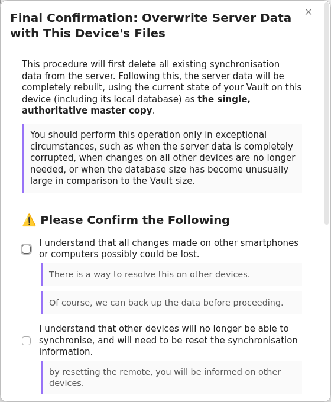
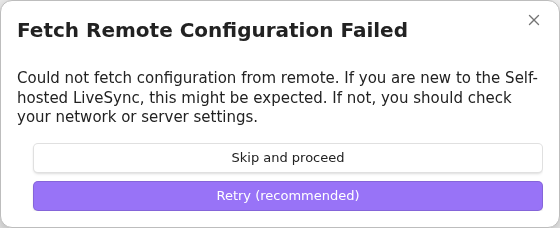
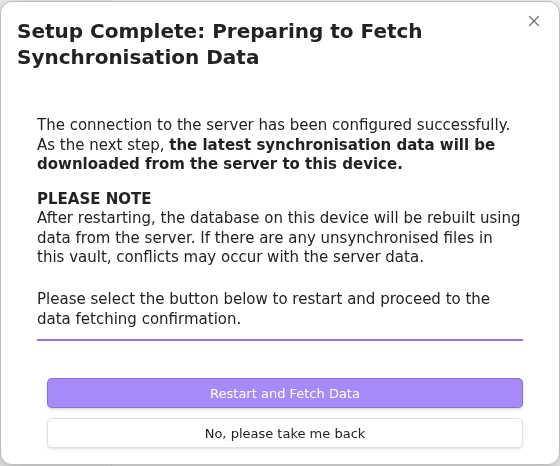
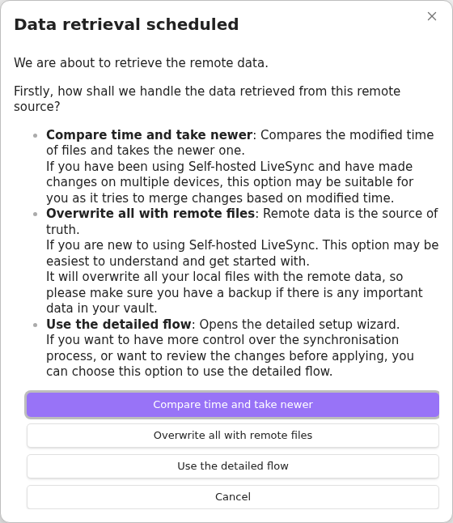
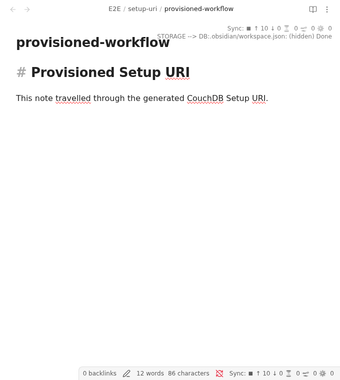

# Quick setup

[Japanese docs](./quick_setup_ja.md) - [Chinese docs](./quick_setup_cn.md).

This guide establishes ordinary note synchronisation on the first device and then adds another device. Optional features are configured only after this basic path works.

Before starting:

- back up every Vault involved;
- disable Obsidian Sync, iCloud synchronisation, and any other service which writes to the same Vault;
- prepare the remote service and a Setup URI; and
- keep the Setup URI and its passphrase separate from each other.

This walkthrough covers the recommended provisioned CouchDB path. Follow [Set up a CouchDB server](./setup_own_server.md) to prepare the server and Setup URI.

## What a Setup URI contains

A Setup URI starts with `obsidian://setuplivesync?settings=`. It contains encrypted connection settings, including credentials, and must be protected even though it is encrypted.

The Setup URI passphrase decrypts the URI. It is different from the Vault encryption passphrase which protects synchronised data. Store both securely, and do not send the Setup URI and its passphrase through the same channel.

## Set up the first device

Use this path only when the remote database is new, or when this device is intentionally the source of truth for a full server rebuild.

1. Install and enable Self-hosted LiveSync in the intended Vault.
2. Select the `Welcome to Self-hosted LiveSync` Notice to open onboarding.
3. Select `I am setting this up for the first time`, then confirm that you want to set up a new synchronisation.
4. On `Connection Method`, select `Use a Setup URI (Recommended)`.
5. Paste the Setup URI, enter its Setup URI passphrase, and select `Test Settings and Continue`.

   

6. Review `Setup Complete: Preparing to Initialise Server`, then select `Restart and Initialise Server`.

   

7. Read the final overwrite warning carefully. Select `I Understand, Overwrite Server` only after checking that backups exist and that replacing the remote data is intended.

   

8. A newly provisioned database may show `Fetch Remote Configuration Failed` because it does not contain a saved preferred configuration yet. If this is a genuinely new setup, select `Skip and proceed`. Otherwise, stop and investigate before continuing.

   

9. Acknowledge `All optional features are disabled`. Optional features remain off until the ordinary synchronisation path has been verified.
10. Allow initialisation and any requested restart to finish. Keep Obsidian open until the LiveSync progress indicators have cleared.

Create an ordinary test note and allow it to upload before adding another device.

## Add another device

Start with a new or separately backed-up Vault. Do not use a production Vault containing unsynchronised notes unless you have reviewed the [Fast Setup choices](./tips/fast-setup.md).

1. Install and enable Self-hosted LiveSync.
2. Open onboarding from the `Welcome to Self-hosted LiveSync` Notice.
3. Select `I am adding a device to an existing synchronisation setup`, then confirm that you want to add the device.
4. On `Device Setup Method`, select `Use a Setup URI (Recommended)`.
5. Paste the same Setup URI, enter its Setup URI passphrase, and select `Test Settings and Continue`.
6. Review `Setup Complete: Preparing to Fetch Synchronisation Data`, then select `Restart and Fetch Data`.

   

7. For a new or empty Vault, select `Overwrite all with remote files`. For a Vault with local work, stop and choose the appropriate strategy from the [Fast Setup guide](./tips/fast-setup.md).

   

8. When asked how to handle extra local files, the conservative choice is `Keep local files even if not on remote`. Select the delete option only when the local Vault is disposable and an exact remote copy is intended.

   

9. Allow retrieval, file reflection, and any requested restart to finish. Keep Obsidian open until the LiveSync progress indicators have cleared.

Confirm that the ordinary test note from the first device appears unchanged. Then edit or create a second ordinary note on the new device, and confirm that it reaches the first device.

## After ordinary synchronisation works

Add optional features separately so that their ownership and initialisation direction are explicit:

- [Hidden File Sync](./tips/hidden-file-sync.md) for selected hidden files and folders; or
- [Customisation Sync](./settings.md#6-customisation-sync-advanced) for managed Obsidian customisations.

Do not enable both features for the same files.

## Manual configuration

If a Setup URI is unavailable, choose `Enter the server information manually` during onboarding. Manual configuration is an advanced path: verify the connection, encryption, remote profile, and synchronisation preset before initialising either side. After the first device works, use `Copy settings as a new Setup URI` from the command palette to add later devices through the recommended path.
