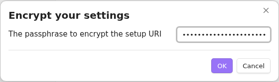
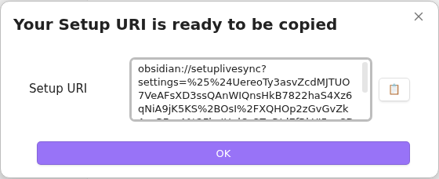
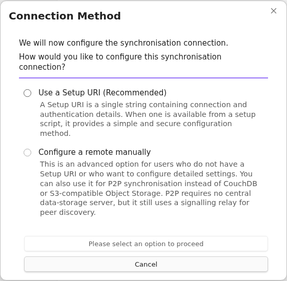
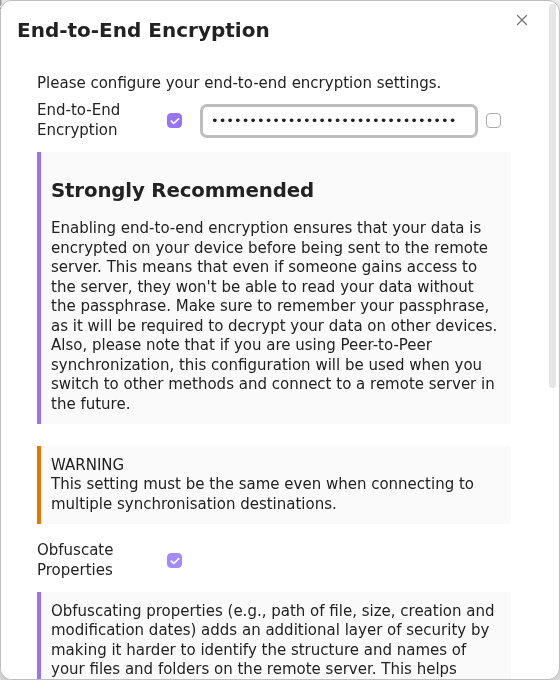
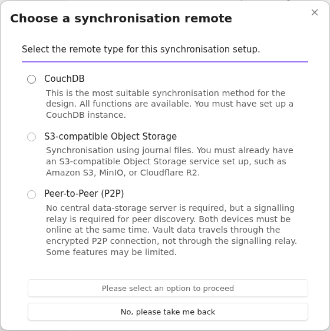
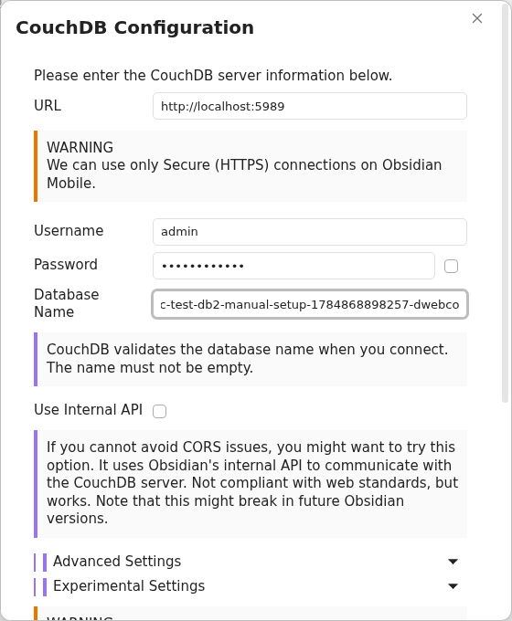
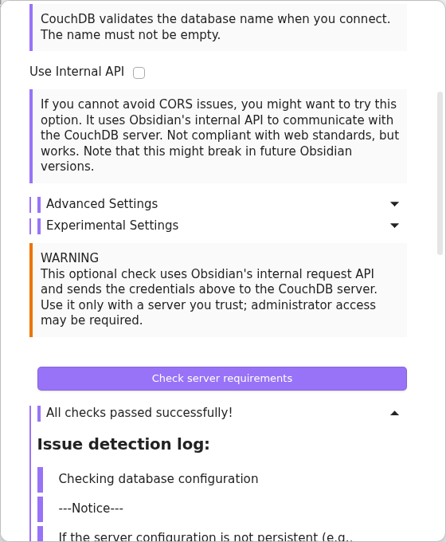

# Quick setup

[Japanese docs](./quick_setup_ja.md) - [Chinese docs](./quick_setup_cn.md).

This guide establishes ordinary note synchronisation on the first device and then adds another device. Optional features are configured only after this basic path works.

Before starting:

- back up every Vault involved;
- disable Obsidian Sync, iCloud synchronisation, and any other service which writes to the same Vault;
- prepare the remote service and a Setup URI; and
- keep the Setup URI and its passphrase separate from each other.

This walkthrough covers the recommended provisioned CouchDB path. Follow [Set up a CouchDB server](./setup_own_server.md) to prepare the server and Setup URI.

## What a Setup URI contains

A Setup URI starts with `obsidian://setuplivesync?settings=`. It contains encrypted connection settings, including credentials, and must be protected even though it is encrypted.

The Setup URI passphrase decrypts the URI. It is different from the Vault encryption passphrase which protects synchronised data. Store both securely, and do not send the Setup URI and its passphrase through the same channel.

## Set up the first device

Use this path only when the remote database is new, or when this device is intentionally the source of truth for a full server rebuild.

1. Install and enable Self-hosted LiveSync in the intended Vault.
2. Select the `Welcome to Self-hosted LiveSync` Notice to open onboarding.
3. Select `I am setting this up for the first time`, then confirm that you want to set up a new synchronisation.
4. On `Connection Method`, select `Use a Setup URI (Recommended)`.
5. Paste the Setup URI, enter its Setup URI passphrase, and select `Test Settings and Continue`.

   

6. Review `Setup Complete: Preparing to Initialise Server`, then select `Restart and Initialise Server`.

   

7. Read the final overwrite warning carefully. Select `I Understand, Overwrite Server` only after checking that backups exist and that replacing the remote data is intended.

   

8. A newly provisioned database may show `Fetch Remote Configuration Failed` because it does not contain a saved preferred configuration yet. If this is a genuinely new setup, select `Skip and proceed`. Otherwise, stop and investigate before continuing.

   

9. Acknowledge `All optional features are disabled`. Optional features remain off until the ordinary synchronisation path has been verified.
10. Allow initialisation and any requested restart to finish. Keep Obsidian open until the LiveSync progress indicators have cleared.

Create an ordinary test note and allow it to upload before adding another device.

## Create a Setup URI for another device

Generate a Setup URI for another device from the working first device. This captures the settings which that device is actually using, rather than asking another device to reuse the Setup URI produced during server provisioning.

1. Open the Obsidian command palette on the first device.
2. Run `Self-hosted LiveSync: Copy settings as a new Setup URI`.
3. Enter a new passphrase which will protect this Setup URI, then select `OK`.

   

4. Copy the resulting Setup URI, then select `OK`.

   

Store the new Setup URI and its passphrase separately. The URI is encrypted, but it contains credentials and Vault settings, so continue to protect it.

## Add another device

Start with a new or separately backed-up Vault. Do not use a production Vault containing unsynchronised notes unless you have reviewed the [Fast Setup choices](./tips/fast-setup.md).

1. Install and enable Self-hosted LiveSync.
2. Open onboarding from the `Welcome to Self-hosted LiveSync` Notice.
3. Select `I am adding a device to an existing synchronisation setup`, then confirm that you want to add the device.
4. On `Device Setup Method`, select `Use a Setup URI (Recommended)`.
5. Paste the new Setup URI generated by the first device, enter its Setup URI passphrase, and select `Test Settings and Continue`.
6. Review `Setup Complete: Preparing to Fetch Synchronisation Data`, then select `Restart and Fetch Data`.

   

7. For a new or empty Vault, select `Overwrite all with remote files`. For a Vault with local work, stop and choose the appropriate strategy from the [Fast Setup guide](./tips/fast-setup.md).

   

8. When asked how to handle extra local files, the conservative choice is `Keep local files even if not on remote`. Select the delete option only when the local Vault is disposable and an exact remote copy is intended.

   

9. Allow retrieval, file reflection, and any requested restart to finish. Keep Obsidian open until the LiveSync progress indicators have cleared.

Confirm that the ordinary test note from the first device appears unchanged. Then edit or create a second ordinary note on the new device, and confirm that it reaches the first device.

## After ordinary synchronisation works

Add optional features separately so that their ownership and initialisation direction are explicit:

- [Hidden File Sync](./tips/hidden-file-sync.md) for selected hidden files and folders; or
- [Customisation Sync](./settings.md#6-customisation-sync-advanced) for managed Obsidian customisations.

Do not enable both features for the same files.

## Configure CouchDB manually on the first device

Use this path when CouchDB is ready but a Setup URI is unavailable. It configures one first device through the visible onboarding dialogue; it does not provision or repair the CouchDB server. Add later devices with a Setup URI generated by this working first device instead of entering the credentials again.

1. Install and enable Self-hosted LiveSync in the intended Vault.
2. Select the `Welcome to Self-hosted LiveSync` Notice, choose `I am setting this up for the first time`, then confirm that you want to set up a new synchronisation.
3. On `Connection Method`, select `Configure a remote manually`, then select `Proceed with manual configuration`.

   

4. On `End-to-End Encryption`, decide how the synchronised data will be protected.
   - For an ordinary new Vault, enable `End-to-End Encryption` and enter a strong Vault encryption passphrase.
   - Enable `Obfuscate Properties` if remote document properties should also be concealed.
   - Store the Vault encryption passphrase securely. It is separate from the passphrase used to protect a Setup URI.

   

5. On `Choose a synchronisation remote`, select `CouchDB`, then select `Continue to CouchDB setup`.

   

6. Enter the complete CouchDB URL, username, password, and database name.
   - Obsidian Mobile requires HTTPS. Plain HTTP is suitable only for a trusted local connection from a desktop device.
   - Use credentials which are allowed to connect to the selected database and, when configuring the first device, create it if it does not exist.

   

7. `Check server requirements` is optional. It sends the displayed credentials to the configured server through Obsidian's internal request API, and some checks require CouchDB administrator access. The initial check is read-only. If it offers a server change, review and confirm that individual change separately.

   

8. Select `Create or connect to database and continue`. Onboarding requires this connection test to succeed.
9. Review `Setup Complete: Preparing to Initialise Server`, then select `Restart and Initialise Server`.
10. Read the final overwrite warning. Select `I Understand, Overwrite Server` only when this device is intentionally the source of truth and a current backup exists.
11. A newly created database can show `Fetch Remote Configuration Failed` because it does not yet contain a saved preferred configuration. Select `Skip and proceed` only for this known new database.
12. Acknowledge `All optional features are disabled`, then keep Obsidian open until the initialisation progress has cleared.

Create and synchronise an ordinary test note. Once it has reached CouchDB, follow [Create a Setup URI for another device](#create-a-setup-uri-for-another-device), then [Add another device](#add-another-device). This keeps the second device aligned with the remote profile and encryption settings which the first device actually applied.
