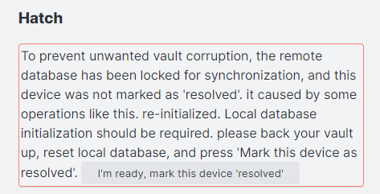
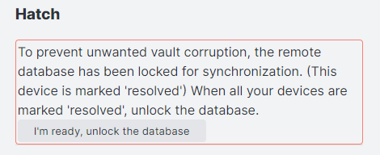
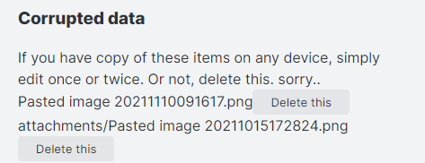

# Settings of this plugin

## Remote Database Configurations
Configure settings of synchronize server. If any synchronization is enabled, you can't edit this section. Please disable all synchronization to change.

### URI
URI of CouchDB. In the case of Cloudant, It's "External Endpoint(preferred)".  
**Do not end it up with a slash** when it doesn't contain the database name.

### Username
Your CouchDB's Username. With administrator's privilege is preferred.

### Password
Your CouchDB's Password.  
Note: This password is saved into your Obsidian's vault in plain text.

### Database Name
The Database name to synchronize.  
⚠️If not exist, created automatically.

### Test Database connection

## Local Database Configurations
"Local Database" is created inside your obsidian.

### Batch database update (beta)
Delay database update until raise replication, open another file, window visibility changed, or file events except for file modification.  
This option can not be used with LiveSync at the same time.

### Auto Garbage Collection delay
When the note has been modified, Self-hosted LiveSync splits the note into some chunks by parsing the markdown structure. And saving only file information and modified chunks into the Local Database. At this time, do not delete old chunks.
So, Self-hosted LiveSync has to delete old chunks somewhen.

However, the chunk is represented as the crc32 of their contents and shared between all notes. In this way, Self-hosted LiveSync dedupes the entries and keeps low bandwidth and low transfer amounts.

In addition to this, when we edit notes, sometimes back to the previous expression. So It cannot be said that it will be unnecessary immediately.

Therefore, the plugin deletes unused chunks at once when you leave Obsidian for a while (after this setting seconds).

This process is called "Garbage Collection"

As a result, Obsidian's behavior is temporarily slowed down.

Default is 300 seconds.
If you are an early adopter, maybe this value is left as 30 seconds. Please change this value to larger values.

### Manual Garbage Collect
Run "Garbage Collection" manually.

### End to End Encryption
Encrypt your database. It affects only the database, your files are left as plain.

The encryption algorithm is AES-GCM.

### Passphrase
The passphrase to used as the key of encryption. Please use the long text.

### Apply
To enable End-to-End encryption, there must be no items of the same content encrypted with different passphrases to avoid attackers guessing passphrases. Self-hosted LiveSync uses crc32 of the chunks, It is really a must.

So, this plugin completely deletes everything from both local and remote databases before enabling it and then synchronizing again.

To enable, "Apply and send" from the most powerful device, and "Apply and receive" from every other device.

- Apply and send
1. Initialize the Local Database and set (or clear) passphrase, put all files into the database again.
2. Initialize the Remote Database.
3. Lock the Remote Database.
4. Send it all.

This process is simply heavy. Using a PC or Mac is preferred.
- Apply and receive
1. Initialize the Local Database and set (or clear) the passphrase.
2. Unlock the Remote Database.
3. Retrieve all and decrypt to file.

When running these operations, every synchronization settings is disabled.

**And even your passphrase is wrong, It doesn't be checked before the plugin really decrypts. So If you set the wrong passphrase and run "Apply and Receive", you will get an amount of decryption error. But, this is the specification.**

## General Settings

### Do not show low-priority log
If you enable this option, log only the entries with the popup.

### Verbose log

## Sync setting

### LiveSync
Do LiveSync.

It is the one of raison d'être of this plugin.

Useful, but this method drains many batteries on the mobile and uses not the ignorable amount of data transfer.

This method is exclusive to other synchronization methods.

### Periodic Sync
Synchronize periodically. 

### Periodic Sync Interval
Unit is seconds.

### Sync on Save
Synchronize when the note has been modified or created.

### Sync on File Open
Synchronize when the note is opened.

### Sync on Start
Synchronize when Obsidian started.

### Use Trash for deleted files
When the file has been deleted on remote devices, deletion will be replicated to the local device and the file will be deleted.

If this option is enabled, move deleted files into the trash instead delete actually.

### Do not delete empty folder
Self-hosted LiveSync will delete the folder when the folder becomes empty. If this option is enabled, leave it as an empty folder.

### Use newer file if conflicted (beta)
Always use the newer file to resolve and overwrite when conflict has occurred.

### minimum chunk size and LongLine threshold
The configuration of chunk splitting.

Self-hosted LiveSync splits the note into chunks for efficient synchronization. This chunk should be longer than "Minimum chunk size".

Specifically, the length of the chunk is determined by the following orders.

1. Find the nearest newline character, and if it is farther than LongLineThreshold, this piece becomes an independent chunk.

2. If not, find nearest to these items.
    1. Newline character
    2. Empty line (Windows style)
    3. Empty line (non-Windows style)
3. Compare the farther in these 3 positions and next "\[newline\]#" position, pick a shorter piece to as chunk.

This rule was made empirically from my dataset. If this rule acts as badly on your data. Please give me the information.

You can dump saved note structure to `Dump informations of this doc`. Replace every character to x except newline and "#" when sending information to me.

Default values are 20 letters and 250 letters.

## Hatch
From here, everything is under the hood. Please handle it with care.

When there are problems with synchronization, the warning message is shown Under this section header.

- Pattern 1  
  
This message is shown when the remote database is locked and your device is not marked as "resolved".  
Almost it is happened by enabling End-to-End encryption or History has been dropped.  
If you enabled End-to-End encryption, you can unlock the remote database by "Apply and receive" automatically. Or "Drop and receive" when you dropped. If you want to unlock manually, click "mark this device as resolved".

- Pattern 2  
  
The remote database indicates that has been unlocked Pattern 1.  
When you mark all devices as resolved, you can unlock the database.
But, there's no problem even if you leave it as it is.

### Drop history
Drop all histories on the local database and the remote database, and initialize When synchronization time has been prolonged to the new device or new vault, or database size became to be much larger. Try this.

Note: When CouchDB deletes entries, to merge confliction, there left old entries as deleted data before compaction. After compaction has been run, deleted data are become "tombstone". "tombstone" uses less disk, But still use some. 

It's the specification, to shrink database size from the root, re-initialization is required, even it's explicit or implicit.

Same as a setting passphrase, database locking is also performed.

- Drop and send (Same as "Apply and send")
1. Initialize the Local Database and set (or clear) passphrase, put all files into the database again.
2. Initialize the Remote Database.
3. Lock the Remote Database.
4. Send it all. 

- Drop and receive (Same as "Apply and receive")
1. Initialize the Local Database and set (or clear) the passphrase.
2. Unlock the Remote Database.
3. Retrieve all and decrypt to file.

### Lock remote database
Lock the remote database to ban out other devices for synchronization. It is the same as the database lock that happened in dropping databases or applying passphrases.

Use it as an emergency evacuation method to protect local or remote databases when synchronization has been broken.

### Suspend file watching
If enable this option, Self-hosted LiveSync dismisses every file change or deletes the event.

From here, these commands are used inside applying encryption passphrases or dropping histories.

Usually, doesn't use it so much. But sometimes it could be handy.

### Reset remote database
Discard the data stored in the remote database.

### Reset local database
Discard the data stored in the local database.

### Initialize local database again
Discard the data stored in the local database and initialize and create the database from the files on storage.

### Corrupted data

When Self-hosted LiveSync could not write to the file on the storage, the files are shown here. If you have the old data in your vault, change it once, it will be cured. Or you can use the "File History" plugin.

But if you don't, sorry, we can't rescue the file, and error messages are shown frequently, and you have to delete the file from here.
