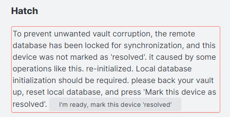
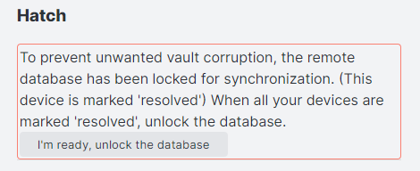
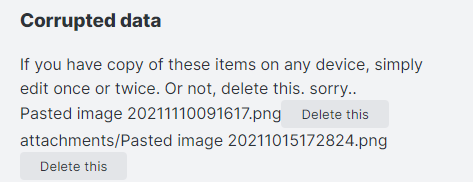

注意：少し内容が古くなっています。

# このプラグインの設定項目

## Remote Database Configurations
同期先のデータベース設定（Remote Server）を行います。

現在のバージョンでは、複数のリモート接続設定（接続プロファイル）を登録・管理し、切り替えて使用することが可能です（「Remote Databases」リスト）。

- **➕ 新規接続を追加 (Add new connection)**: 新しい接続設定を作成し、各セットアップダイアログを起動します。
- **📥 接続をインポート (Import connection)**: 接続文字列（`sls+https://...`、`sls+s3://...`、`sls+p2p://...`など）を貼り付けてインポートします。
- **🔧 設定 (Configure)**: セットアップダイアログを開き、選択した接続プロファイルの設定を編集します。
- **✅ 有効化 (Activate)**: 選択したプロファイルをアクティブな同期先として有効化します。
- **🗑️ 削除 (Delete)**: 接続プロファイルを一覧から削除します。

これらの接続プロファイルを追加・編集する際、選択したデータベースの種類（CouchDB、S3互換オブジェクトストレージ、P2Pなど）に応じたセットアップダイアログが開きます。

何らかの同期が有効になっている場合は編集できないため、同期を解除してから行ってください。

### CouchDB の設定
CouchDBの各設定項目は、接続プロファイルを追加 (➕) または設定 (🔧) する際に開く **CouchDB セットアップダイアログ** 内で設定します。

#### URI
設定キー: couchDB_URI

CouchDBの接続先URIです。ダイアログ内では **URL** と表記されます。Cloudantの場合は「External Endpoint (preferred)」になります。
注意: Obsidian Mobileではセキュア接続 (HTTPS) のみが使用可能です。また、末尾にスラッシュ（`/`）を付けてはいけません。

#### Username
設定キー: couchDB_USER

CouchDBのログインユーザー名です。ダイアログ内では **Username** と表記されます。このユーザーには管理者権限があることが望ましいです。

#### Password
設定キー: couchDB_PASSWORD

CouchDBのログインパスワードです。ダイアログ内では **Password** と表記されます。

#### Database Name
設定キー: couchDB_DBNAME

同期先のデータベース名です。ダイアログ内では **Database Name** と表記されます。
注意: データベース名には大文字、スペース、および一部の特殊文字（`_$()+/-` 以外）は使用できません。また、アンダースコア（`_`）から始めることはできません。存在しない場合は、接続テスト時または設定適用時に自動作成されます（作成権限が必要です）。

#### CORS回避のためにRequest APIを使用する
設定キー: useRequestAPI

この項目はセットアップダイアログ内では **Use Internal API** と表記されます。有効な場合、不可避なCORS問題を回避するためにObsidianの内部Request APIを使用します。これはWeb標準に準拠していない回避策であり、すべての環境での動作を保証するものではありません。安全性が低下する可能性がある点にご注意ください。将来のObsidianのアップデートによって動作しなくなる可能性があります。

#### カスタムヘッダー
設定キー: couchDB_CustomHeaders

CouchDBサーバーに送信するすべてのリクエストに含めるカスタムHTTPヘッダーを設定します。ダイアログ内では **Custom Headers** と表記されます。`ヘッダー名: 値` の形式で、1行に1つずつ入力してください。

#### JWT認証の使用 (実験的機能)
設定キー: useJWT

CouchDBでのJSON Web Token (JWT) 認証を有効にします。ダイアログ内では **Use JWT Authentication** と表記されます。十分に検証されていない実験的機能であるため、ご注意ください。

#### JWTアルゴリズム
設定キー: jwtAlgorithm

JWTの署名に使用するアルゴリズムを選択します。ダイアログ内では **JWT Algorithm** と表記されます。対応アルゴリズム: `HS256`, `HS512`, `ES256`, `ES512`

#### JWT有効期限 (分)
設定キー: jwtExpDuration

トークンの有効期限を分単位で指定します。ダイアログ内では **JWT Expiration Duration (minutes)** と表記されます。`0` を指定すると有効期限は無効になります。

#### JWTキー
設定キー: jwtKey

JWTの署名に使用する秘密鍵またはプライベートキーを指定します。ダイアログ内では **JWT Key** と表記されます。`HS256/HS512` の場合は共通鍵を、`ES256/ES512` の場合は pkcs8 PEM形式の秘密鍵を入力してください。

#### JWTキーID (kid)
設定キー: jwtKid

JWTヘッダーに含めるキーIDを指定します。ダイアログ内では **JWT Key ID (kid)** と表記されます。

#### JWTサブジェクト (sub)
設定キー: jwtSub

JWTのサブジェクト (CouchDBユーザー名) を指定します。ダイアログ内では **JWT Subject (sub)** と表記されます。 

### Object Storage (Minio, S3, R2) の設定
Object Storageの各設定項目は、接続プロファイルを追加 (➕) または設定 (🔧) する際に開く **S3/MinIO/R2 セットアップダイアログ** 内で設定します。

#### エンドポイントURL
設定キー: endpoint

S3互換ストレージのエンドポイントURLです。ダイアログ内では **Endpoint URL** と表記されます。
注意: Obsidian Mobileではセキュア接続 (HTTPS) のみが使用可能です。

#### アクセスキー ID
設定キー: accessKey

認証に使用するアクセスキーIDです。ダイアログ内では **Access Key ID** と表記されます。

#### シークレットアクセスキー
設定キー: secretKey

認証に使用するシークレットアクセスキーです。ダイアログ内では **Secret Access Key** と表記されます。

#### リージョン
設定キー: region

ストレージのリージョンを指定します（例: `us-east-1`、Cloudflare R2の場合は `auto`）。ダイアログ内では **Region** と表記されます。

#### バケット名
設定キー: bucket

同期データを保存するバケット名です。ダイアログ内では **Bucket Name** と表記されます。

#### カスタムHTTPハンドラーを使用する
設定キー: useCustomRequestHandler

この項目はセットアップダイアログ内では **Use internal API** と表記されます。オブジェクトストレージがCORSをサポートしていない場合に有効にします。Obsidianの内部APIを使用してS3サーバーと通信することでCORS制約を回避します。Web標準には準拠していないため、将来のObsidianのアップデートによって動作しなくなる可能性があります。

#### バケット内のファイルプレフィックス
設定キー: bucketPrefix

この項目はセットアップダイアログ内では **Folder Prefix** と表記されます。実質的なディレクトリ指定です。末尾は `/` である必要があります（例：`vault-name/`）。バケットのルートに保存する場合は空欄のままにしてください。

#### forcePathStyleを有効にする
設定キー: forcePathStyle

この項目はセットアップダイアログ内では **Use Path-Style Access** と表記されます。有効な場合、バケット操作でforcePathStyleオプションを使用します。

#### カスタムヘッダー
設定キー: bucketCustomHeaders

オブジェクトストレージバケットに送信するすべてのリクエストに含めるカスタムHTTPヘッダーを設定します。ダイアログ内では **Custom Headers** と表記されます。`ヘッダー名: 値` の形式で、1行に1つずつ入力してください。

### End to End Encryption
データベースを暗号化します。この効果はデータベースに格納されるデータに限られ、ディスク上のファイルは平文のままです。  
暗号化はAES-GCMを使用して行っています。

### Passphrase
暗号化を行う際に使用するパスフレーズです。充分に長いものを使用してください。

### パスの難読化
設定キー: usePathObfuscation

ダイアログ内では **Obfuscate Properties** と表記されます。有効な場合、リモートサーバー上でのファイルパスやフォルダ名を難読化（暗号化）します。これによりプライバシーが向上しますが、パフォーマンスがわずかに低下する可能性があります。

### 暗号化アルゴリズム
設定キー: E2EEAlgorithm

ダイアログ内では **Encryption Algorithm** と表記されます。エンドツーエンド暗号化に使用する暗号化アルゴリズムのバージョンを選択します。
- `v2` (V2: AES-256-GCM With HKDF): 推奨されるデフォルトのバージョンです。
- `forceV1` または `""` (V1: Legacy): レガシーな暗号化バージョンです。古いバージョンで暗号化された既存の保管庫（Vault）を同期する場合にのみ使用してください。

### Apply
End to End 暗号化を行うに当たって、異なるパスフレーズで暗号化された同一の内容を入手されることは避けるべきです。また、Self-hosted LiveSyncはコンテンツのcrc32を重複回避に使用しているため、その点でも攻撃が有効になってしまいます。

そのため、End to End 暗号化を有効にする際には、ローカル、リモートすべてのデータベースをいったん破棄し、新しいパスフレーズで暗号化された内容のみを、改めて同期し直します。

有効化するには、一番体力のある端末からApply and sendを行います。
既に存在するリモートと同期する場合は、設定してJust applyを行ってください。

- Apply and send   
1. ローカルのデータベースを初期化しパスフレーズを設定（またはクリア）します。その後、すべてのファイルをもう一度データベースに登録します。
2. リモートのデータベースを初期化します。
3. リモートのデータベースをロックし、他の端末を締め出します。
4. すべて再送信します。

負荷と時間がかかるため、デスクトップから行う方が好ましいです。
- Apply and receive
1. ローカルのデータベースを初期化し、パスフレーズを設定（またはクリア）します。
2. リモートのデータベースにかかっているロックを解除します。
3. すべて受信して、復号します。

どちらのオペレーションも、実行するとすべての同期設定が無効化されます。  

### Test Database connection
上記の設定でデータベースに接続できるか確認します。

### Check database configuration
ここから直接CouchDBの設定を確認・変更できます。

### Peer-to-Peer (P2P) 同期の設定

#### P2P同期を有効にする
設定キー: P2P_Enabled

WebRTCを介したデバイス間での直接的なP2P同期を有効にします。ダイアログ内では **Enabled** と表記されます。

#### リレーサーバーのURL
設定キー: P2P_relays

WebRTCによるP2P接続を仲介・調整するためのWebSocketリレーサーバーのURLを指定します。ダイアログ内では **Relay URL** と表記されます。複数のURLを指定する場合はカンマで区切ります。ダイアログ内のボタンをクリックすると、デフォルトのリレーサーバーを設定できます。

#### グループID
設定キー: P2P_roomID

同期するデバイス群を識別するためのルームIDまたはグループIDを指定します。ダイアログ内では **Group ID** と表記されます。同期させたいすべてのデバイスで同じグループIDを指定する必要があります。任意のカスタム文字列を入力するか、ランダム生成ボタンで生成できます。

#### パスフレーズ
設定キー: P2P_passphrase

P2P通信の認証および暗号化に使用するパスワード（パスフレーズ）を指定します。ダイアログ内では **Passphrase** と表記されます。同期するすべてのデバイスで同じパスフレーズを指定する必要があります。

#### デバイス名
設定キー: P2P_DevicePeerName

P2Pネットワーク上でこのデバイスを識別するための名前を指定します。ダイアログ内では **Device Peer ID** と表記されます。グループ内のデバイス間で重複しない一意の値を設定してください。

#### 起動時のP2P自動接続開始
設定キー: P2P_AutoStart

有効な場合、プラグインの起動時に自動的にP2P接続を開始します。ダイアログ内では **Auto Start P2P Connection** と表記されます。

#### 接続済みピアへの変更の自動ブロードキャスト
設定キー: P2P_AutoBroadcast

有効な場合、ローカルでの変更が接続済みのピアに自動的にブロードキャストされます。ダイアログ内では **Auto Broadcast Changes** と表記されます。通知されたピアは変更の取得を開始します。

#### TURNサーバーのURL (カンマ区切り)
設定キー: P2P_turnServers

ダイアログ内では **TURN Server URLs (comma-separated)** と表記されます。厳しいNATやファイアウォールがある環境で、WebRTCの直接接続が確立できない場合にP2P接続を中継するためのTURN/STUNサーバーのURLをカンマ区切りで指定します。通常は空欄のままで問題ありません。

#### TURNユーザー名
設定キー: P2P_turnUsername

TURNサーバーでの認証に使用するユーザー名を設定します。ダイアログ内では **TURN Username** と表記されます。

#### TURNパスワード
設定キー: P2P_turnCredential

TURNサーバーでの認証に使用するパスワード（クレデンシャル）を設定します。ダイアログ内では **TURN Credential** と表記されます。

## Local Database Configurations
端末内に作成されるデータベースの設定です。

### Batch database update
データベースの更新を以下の事象が発生するまで遅延させます。
- レプリケーションが発生する
- 他のファイルを開く
- ウィンドウの表示状態を変更する
- ファイルの修正以外のファイル関連イベント
このオプションはLiveSyncと同時には使用できません。

### minimum chunk size と LongLine threshold
チャンクの分割についての設定です。※現在これらの項目はUIから直接設定することはできません（デフォルト値で自動処理されます）。

Self-hosted LiveSyncは一つのチャンクのサイズを最低minimum chunk size文字確保した上で、できるだけ効率的に同期できるよう、ノートを分割してチャンクを作成します。  
これは、同期を行う際に、一定の文字数で分割した場合、先頭の方を編集すると、その後の分割位置がすべてずれ、結果としてほぼまるごとのファイルのファイル送受信を行うことになっていた問題を避けるために実装されました。  
具体的には、先頭から順に直近の下記の箇所を検索し、一番長く切れたものを一つのチャンクとします。

1. 次の改行を探し、それがLongLine Thresholdより先であれば、一つのチャンクとして確定します。

2. そうではない場合は、下記を順に探します。
	1. 改行
	2. windowsでの空行がある所
	3. 非Windowsでの空行がある所
3. この三つのうち一番遠い場所と、 「改行後、#から始まる所」を比べ、短い方をチャンクとします。

このルールは経験則的に作りました。実データが偏っているため。もし思わぬ挙動をしている場合は、是非コマンドから`Dump informations of this doc`を選択し、情報をください。  
改行文字と#を除き、すべて●に置換しても、アルゴリズムは有効に働きます。  
デフォルトは20文字と、250文字です。

### チャンクスプリッター
設定キー: chunkSplitterVersion

チャンク分割アルゴリズムを選択します。V3が最も効率的です。問題が発生した場合はDefaultまたはLegacyに設定してください。

## General Settings
一般的な設定です。

### Do not show low-priority log
有効にした場合、優先度の低いログを記録しません。通知を伴うログのみ表示されます。

### Vervose log
詳細なログをログに出力します。

### ファイル警告バナーの代わりにステータスアイコンを表示
設定キー: hideFileWarningNotice

有効な場合、ファイル警告バナーの代わりにステータス表示内に ⛔ アイコンが表示されます（詳細情報は非表示になります）。

### ネットワーク警告のスタイル
設定キー: networkWarningStyle

同期サーバーに接続できない場合のネットワークエラーの表示方法。

## Sync setting
同期に関する設定です。

### 同期モード (Sync Mode)
設定キー: syncMode

同期処理を実行するトリガーとなる条件を設定します。
- **LiveSync** (`LIVESYNC`): リアルタイムかつ継続的な双方向同期を行います。
  注意: このモードには CouchDB または WebRTC P2P リモートサーバーが必要です。S3互換オブジェクトストレージではサポートされていません。
- **Periodic Sync** (`PERIODIC`): **Periodic Sync Interval** で指定した一定の間隔ごとに同期処理を実行します。
- **On Events** (`ONEVENTS`): ファイルの保存、ファイルを開く、起動時など、特定のイベントが発生した際に同期をトリガーします（詳細は下部の設定スイッチで制御します）。

### Periodic Sync Interval
定期的に同期を行う場合の間隔（秒単位）です。

### 同期の最小間隔
設定キー: syncMinimumInterval

イベント時の自動同期の最小間隔（ミリ秒）。

### Sync on Save
ファイルが保存されたときに同期を行います。  
**Obsidianは、ノートを編集している間、定期的に保存を行います。添付ファイルを新しく追加した場合も同様に処理されます。**

### Sync on File Open
ファイルを開いた際に同期を行います。

### Sync on Start
Obsidianの起動時に同期を行います。

備考:
LiveSyncをONにするか、もしくはPeriodic Sync + Sync On File Openがオススメです。

### Use Trash for deleted files
リモートでファイルが削除された際、デバイスにもその削除が反映されます。  
このオプションが有効になっている場合、実際に削除する代わりに、ゴミ箱に移動します。

### Do not delete empty folder
Self-hosted LiveSyncは通常、フォルダ内のファイルがすべて削除された場合、フォルダを削除します。  
備考:Self-hosted LiveSyncの同期対象はファイルです。

### Use newer file if conflicted (beta)
競合が発生したとき、常に新しいファイルを使用して競合を自動的に解決します。

### Experimental.
### Sync hidden files

隠しファイルを同期します

- Scan hidden files before replication.
このオプション有効にすると、レプリケーションを実行する前に隠しファイルをスキャンします。

- Scan hidden files periodicaly.
このオプションを有効にすると、n秒おきに隠しファイルをスキャンします。

#### 非表示ファイルの変更通知を抑制
設定キー: suppressNotifyHiddenFilesChange

有効な場合、非表示ファイルの変更に関する通知を抑制します。

隠しファイルは能動的に検出されないため、スキャンが必要です。
スキャンでは、ファイルと共にファイルの変更時刻を保存します。もしファイルが消された場合は、その事実も保存します。このファイルを記録したエントリーがレプリケーションされた際、ストレージよりも新しい場合はストレージに反映されます。

そのため、端末のクロックは時刻合わせされている必要があります。ファイルが隠しフォルダに生成された場合でも、もし変更時刻が古いと判断された場合はスキップされるかキャンセル（つまり、削除）されます。

Each scan stores the file with their modification time. And if the file has been disappeared, the fact is also stored. Then, When the entry of the hidden file has been replicated, it will be reflected in the storage if the entry is newer than storage.

Therefore, the clock must be adjusted. If the modification time is old, the changeset will be skipped or cancelled (It means, **deleted**), even if the file spawned in a hidden folder.

### Advanced settings
Self-hosted LiveSyncはPouchDBを使用し、リモートと[このプロトコル](https://docs.couchdb.org/en/stable/replication/protocol.html)で同期しています。  
そのため、全てのノートなどはデータベースが許容するペイロードサイズやドキュメントサイズに併せてチャンクに分割されています。

しかしながら、それだけでは不十分なケースがあり、[Replicate Changes](https://docs.couchdb.org/en/stable/replication/protocol.html#replicate-changes)の[2.4.2.5.2. Upload Batch of Changed Documents](https://docs.couchdb.org/en/stable/replication/protocol.html#upload-batch-of-changed-documents)を参照すると、このリクエストは巨大になる可能性がありました。

残念ながら、このサイズを呼び出しごとに自動的に調整する方法はありません。  
そのため、設定を変更できるように機能追加いたしました。

備考：もし小さな値を設定した場合、リクエスト数は増えます。  
もしサーバから遠い場合、トータルのスループットは遅くなり、転送量は増えます。

### Batch size
一度に処理するChange feedの数です。デフォルトは250です。

### Batch limit
一度に処理するBatchの数です。デフォルトは40です。

### 1回のリクエストで送信するチャンクの最大サイズ
設定キー: sendChunksBulkMaxSize

メガバイト（MB）単位で指定します。

## Customisation Sync (カスタマイズ同期)
プラグイン、ホットキー、テーマ、スニペットなどのObsidianのカスタマイズ設定を同期する機能です（以前は **Plugin Sync** と呼ばれていました）。

### デバイス名 (Device name)
設定キー: deviceAndVaultName

同期するすべてのデバイス間で一意となるデバイス名です。この設定を編集するには、一度カスタマイズ同期を無効にする必要があります。

### ファイル保存ごとのカスタマイズ同期 (Per-file-saved customisation sync)
設定キー: usePluginSyncV2

有効な場合、ファイルごとの効率的なカスタマイズ同期が使用されます。有効にする際には簡単な移行作業が必要であり、すべてのデバイスを v0.23.18 以降にアップデートする必要があります。この機能を有効にすると、古いバージョンとの互換性が失われます。

### カスタマイズ同期を有効にする (Enable customisation sync)
設定キー: usePluginSync

テーマ、スニペット、ホットキー、プラグイン設定などの同期を有効にします。
注意: 安全上の理由から、この機能を使用するにはエンドツーエンド暗号化（End-to-End Encryption）が有効になっている必要があります。

### カスタマイズの自動スキャン (Scan customisation automatically)
設定キー: autoSweepPlugins

レプリケーション（同期処理）を実行する前に、カスタマイズ設定の変更をスキャンします。

### 定期的なカスタマイズのスキャン (Scan customisation periodically)
設定キー: autoSweepPluginsPeriodic

1分ごとにカスタマイズ設定の変更を定期的にスキャンします。

### カスタマイズ更新の通知 (Notify customised)
設定キー: notifyPluginOrSettingUpdated

他のデバイスで新しくカスタマイズ設定が更新されたときに通知を表示します。

## Miscellaneous
その他の設定です
### Show status inside editor
同期の情報をエディター内に表示します。  
モバイルで便利です。

### Check integrity on saving
保存時にデータが全て保存できたかチェックを行います。

## Hatch
ここから先は、困ったときに開ける蓋の中身です。注意して使用してください。

同期の状態に問題がある場合、Hatchの直下に警告が表示されることがあります。

- パターン１  
  
データベースがロックされていて、端末が「解決済み」とマークされていない場合、警告が表示されます。  
他のデバイスで、End to End暗号化を有効にしたか、Drop Historyを行った等、他の端末がそのまま同期を行ってはいない状態に陥った場合表示されます。  
暗号化を有効化した場合は、パスフレーズを設定して「このデバイスの同期状態をリセット」、または「このデバイスのファイルでサーバーデータを上書き」を行うと自動的に解除されます。  
手動でこのロックを解除する場合は「I've made a backup, mark this device 'resolved'」をクリックしてください。

- パターン２  
  
リモートのデータベースが、過去、パターン１を解除したことがあると表示しています。  
ご使用のすべてのデバイスでロックを解除した場合は、データベースのロックを解除することができます。  
ただし、このまま放置しても問題はありません。

### Verify and repair all files
Vault内のファイルを全て読み込み直し、もし差分があったり、データベースから正常に読み込めなかったものに関して、データベースに反映します。

- このデバイスの同期状態をリセット (Reset Synchronisation on This Device)
ローカルのデータベースを破棄し、リモートのデータから再構築します。
- このデバイスのファイルでサーバーデータを上書き (Overwrite Server Data with This Device's Files)
ローカルおよびリモートのデータベースをこのデバイス上のファイルで再構築（上書き）します。

### Lock remote database
リモートのデータベースをロックし、他の端末で同期を行おうとしてもエラーとともに同期がキャンセルされるように設定します。これは、データベースの再構築を行った場合、自動的に設定されるものと同じものです。

万が一同期に不具合が発生していて、使用しているデバイスのデータ＋サーバーのデータを保護する場合などに、緊急避難的に使用してください。

### Scram スイッチ (Scram Switches)
データベースの破損や予期しないデータ喪失を防ぐために、同期処理を緊急停止するためのスイッチです。重大な設定不一致や同期エラーが発生した場合、プラグインは自動的に Scram 状態に移行し、同期動作を一時停止することがあります。

#### ファイルの更新監視を一時停止 (Suspend file watching)
設定キー: suspendFileWatching

ローカルファイル変更の監視と検知を停止します。

#### データベース反映を一時停止 (Suspend database reflecting)
設定キー: suspendParseReplicationResult

データベースでの変更をストレージファイル（Vault内のファイル）へ書き戻す処理を停止します。

### 互換性（メタデータ）(Compatibility (Metadata))

#### 削除済みファイルのメタデータを保持しない (Do not keep metadata of deleted files.)
設定キー: deleteMetadataOfDeletedFiles

ファイルを削除した際に、そのファイルの同期履歴メタデータも即座にデータベースから削除し、保持しないようにします。

#### 削除済みデータのメタデータをクリーンナップする (Delete old metadata of deleted files on start-up)
設定キー: automaticallyDeleteMetadataOfDeletedFiles

ファイルを削除した際のメタデータを保持する期間（日数）を設定します。指定した日数を経過した古い削除済みファイルのメタデータは、プラグイン起動時にデータベースから自動的に削除（クリーンナップ）されます。`0` を指定すると自動削除は無効になります。

### 破損している可能性があるファイルも処理する
設定キー: processSizeMismatchedFiles

サイズ不一致のあるファイルを処理します。特定のAPIや外部連携によって作成されたファイルを同期する際に役立ちます。

### Remediation

#### イベント反映時の最大ファイル更新日時
設定キー: maxMTimeForReflectEvents

この値（Unixエポックからの秒数）より新しい更新日時を持つファイルについては、イベントの反映を無視します。0を指定すると制限が無効になります。

### Corrupted data

データベースからストレージに書き出せなかったファイルがここに表示されます。  
もし、Obsidian内にそのデータが存在する場合は、一度編集を行い、上書きを行うと保存に成功する場合があります。（File Historyプラグインで救っても大丈夫です）  
それ以外の場合は、残念ながら復旧手段がないため、データベース上の破損したファイルを削除しない限り、エラーが表示されます。  
その「データベース上の破損したファイルを削除」するボタンです。

