# IBM Cloudantのセットアップ

## インスタンスの作成
下記の手順で、試用のためにIBM Cloudantのインスタンスを作成できます。

1. 「リソースの作成」ボタンをクリックします。  
   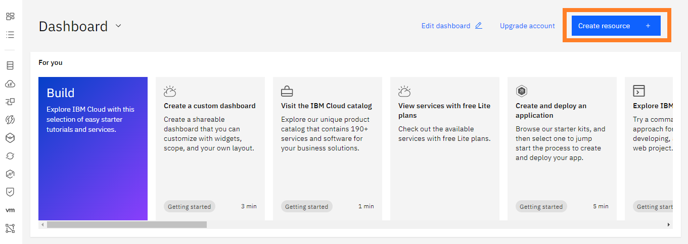

1. カタログが開くので、「Cloudant」と検索してください。出てきた選択肢をクリックすると作成画面に進みます。  
   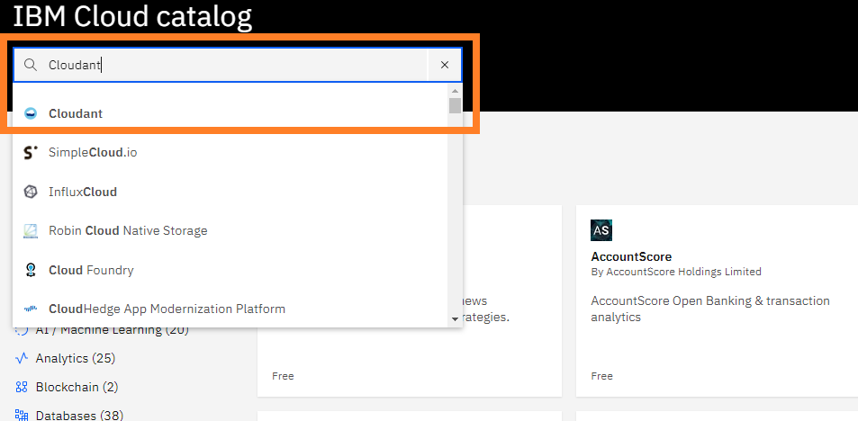

1. Liteプランを選択してください。  
   

1. リージョンと環境を選択します。LiteではMultitenantしか選択できないので、Multitenantを選択してください。デフォルトで選択されています。  
リージョンはお好みの場所で作成してください。
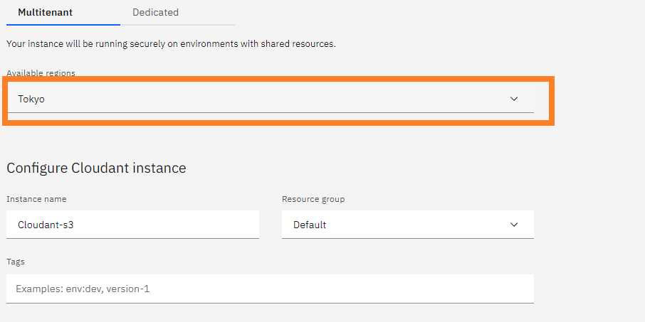 

3. "Authentication Method"で「IAM and legacy credentials」を選択します。  
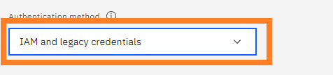

4. Liteプランが選択されていることと、Capacityを確認します。  
   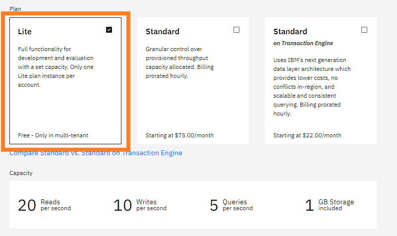

5. 確認ができたら、右側のCreateボタンをクリックします。  
   

6. 上記の手順が正常に完了したら、左のメニューから「リソース・リスト」をクリックしてください。リソース・リストが表示され、「サービス及びソフトウエア」に作成したCloudantのインスタンスが表示されます。  
インスタンス名をクリックしてください。  
   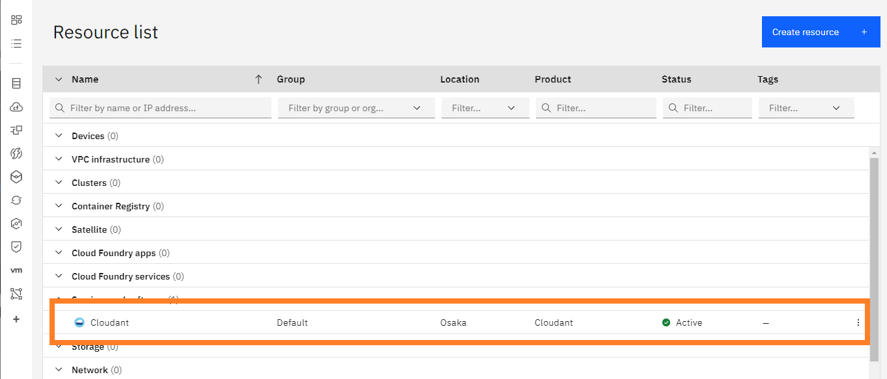

7. ここで、"External Endpoint (preferred)" と記載されているアドレスを控えてください。後ほど使います。(\*1)  
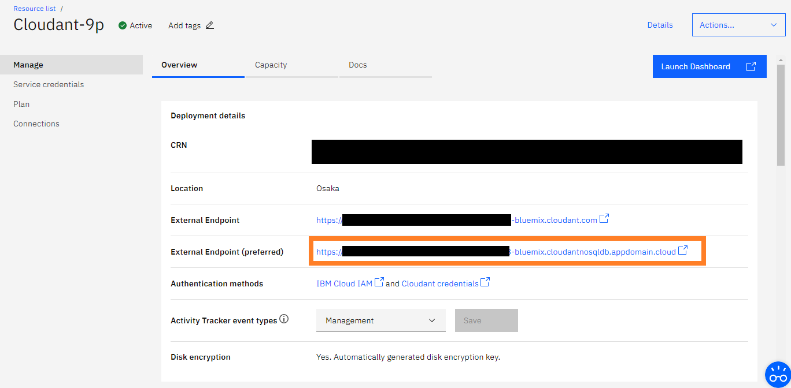

## データベースの設定

1. 「Launch Dashboard」ボタンをクリックします。そうすると、今度はデータベースのダッシュボードが表示されます。CouchDBには、Fauxtonというインターフェイスがあるのですが、それそのものです。  
    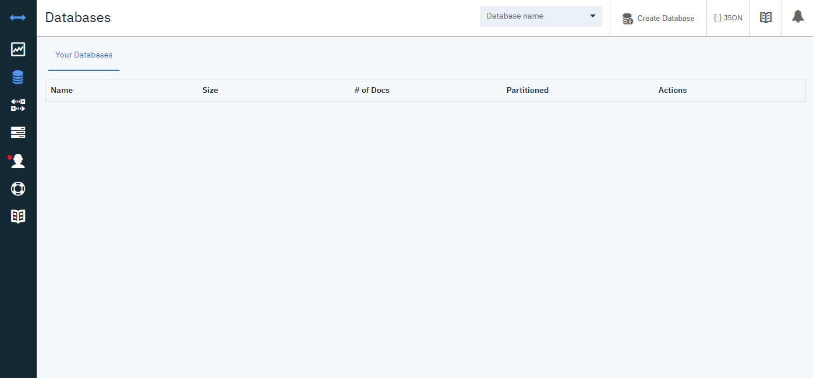

1.  CORSの許可設定を行います。メニューの「Account」をクリックし、「CORS」タブを開きます。  
最初は「Restrict to specific domains」が選択されているので、「All domains (\*)」を選択し直します。この反映は即座に行われますが、すぐに戻せるので大丈夫です。  
    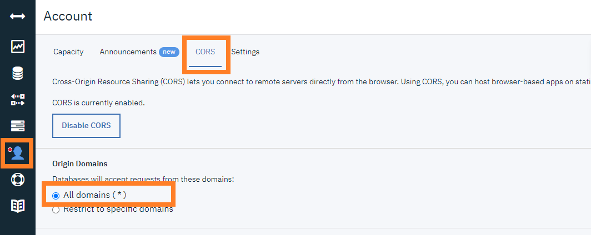

1. データベースが作成できるか確認します。メニューの「Databases」をクリックし、次に「Create Database」ボタンをクリックします。  
右側にパネルが表示されますので、好きな名前を入力し、「Create」ボタンをクリックします。  
    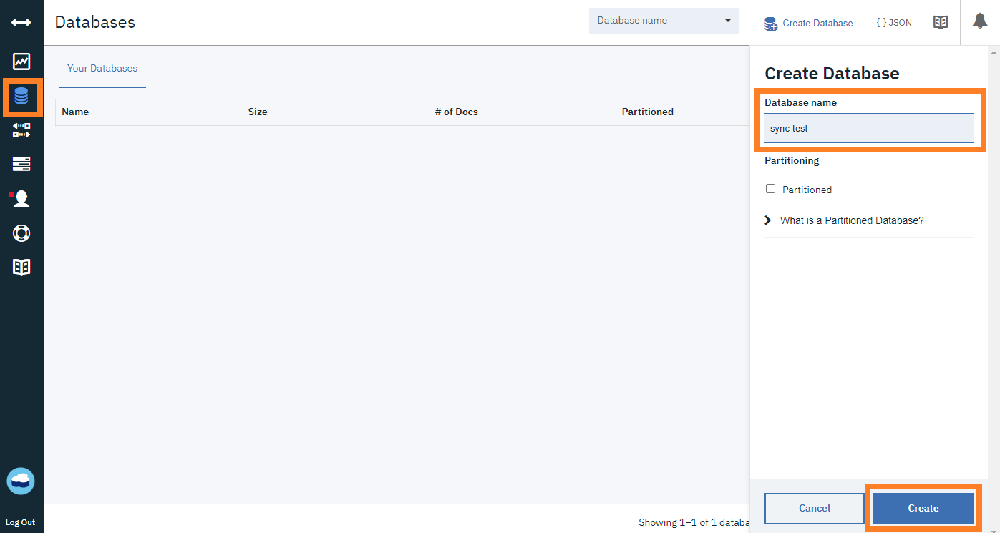

1.  それっぽいメッセージが表示された後、データベースが表示されていれば、ほとんどセットアップは完了です。今後、ほとんどこの画面は使いません。Self-hosted LiveSyncからデータベースは作成できます。  
    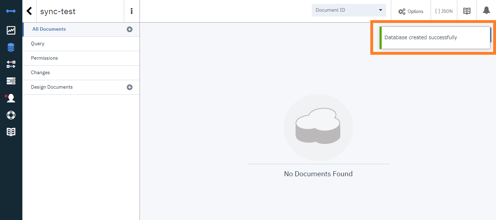

### 資格情報のセットアップ

1. IBM Cloudに戻って、「サービス資格情報」をクリックしてください。おそらく何も表示されていないので、「新規資格情報」をクリックします。  
    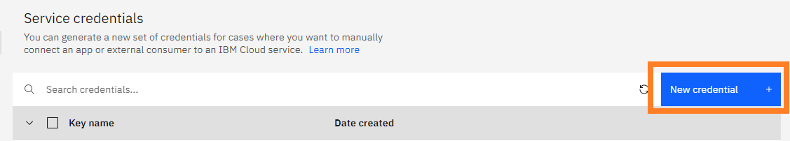

1.  資格情報を作成するダイアログが表示されるので、わかりやすい名前を入力します。その後、役割に「管理者」が選択されていることを確認してから、「追加」ボタンをクリックしてください。  
    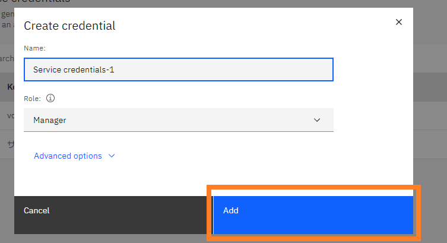  
    備考: この「名前」はSelf-hosted LiveSyncで使用するUsernameとはまた別のものです。

1. 「サービス資格情報」に戻ると、新しい資格情報が作成されています。~~わかりにくいことに名前は「鍵名」に変わります~~。左側のボタンを押すと詳細が開きます。  
    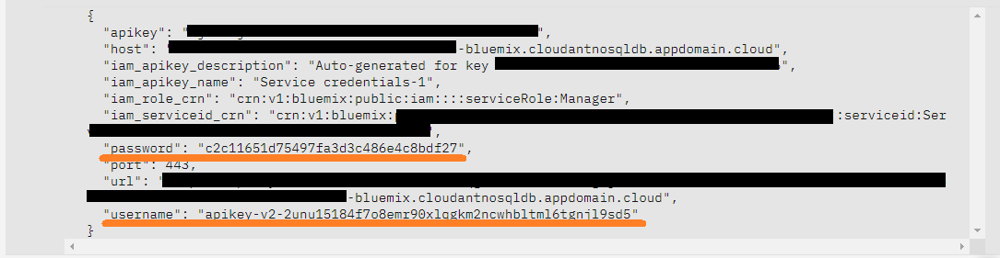  
    Self-hosted LiveSyncから使用するUsernameとPasswordは、表示されたJSONに記載されているものを使用します。  
	今回の図で言うと、Usernameは"apikey-v2-2unu15184f7o8emr90xlqgkm2ncwhbltml6tgnjl9sd5"(\*3)、パスワードは"c2c11651d75497fa3d3c486e4c8bdf27"(\*4)になります。

## Self-hosted LiveSyncに設定

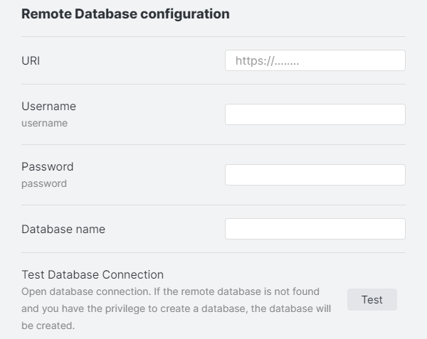

先ほどの設定例から引用すると、

| Items               | Value                            | example                                                                     |
| ------------------- | -------------------------------- | --------------------------------------------------------------------------- |
| URI | (\*1) | https://xxxxxxxxxxxxxxxxx-bluemix.cloudantnosqldb.appdomain.cloud |
| Username    | (\*3)                            | apikey-v2-2unu15184f7o8emr90xlqgkm2ncwhbltml6tgnjl9sd5                      |
| Password    | (\*4)                            | c2c11651d75497fa3d3c486e4c8bdf27                                            |
| Database name    | (\*2)                            | sync-test                                            |

となります。
