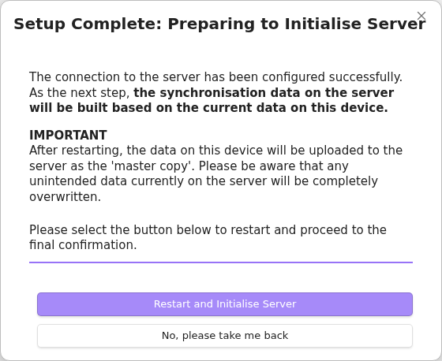
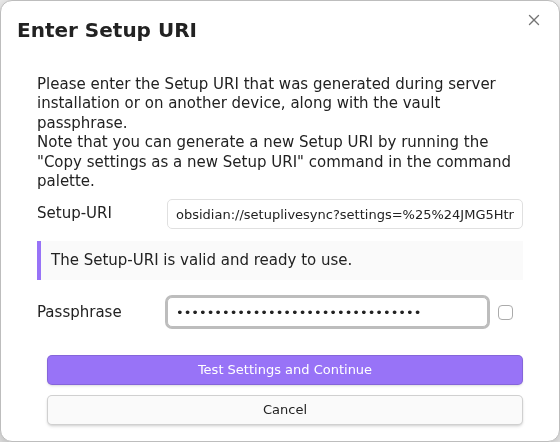
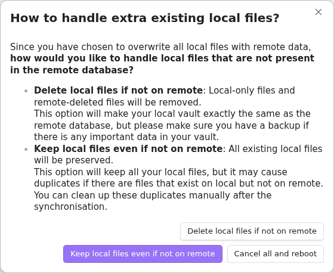
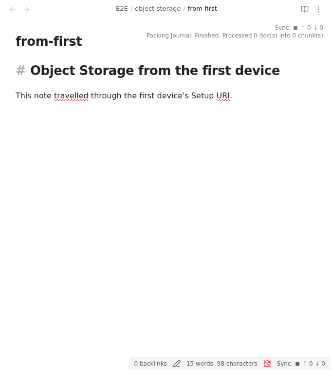
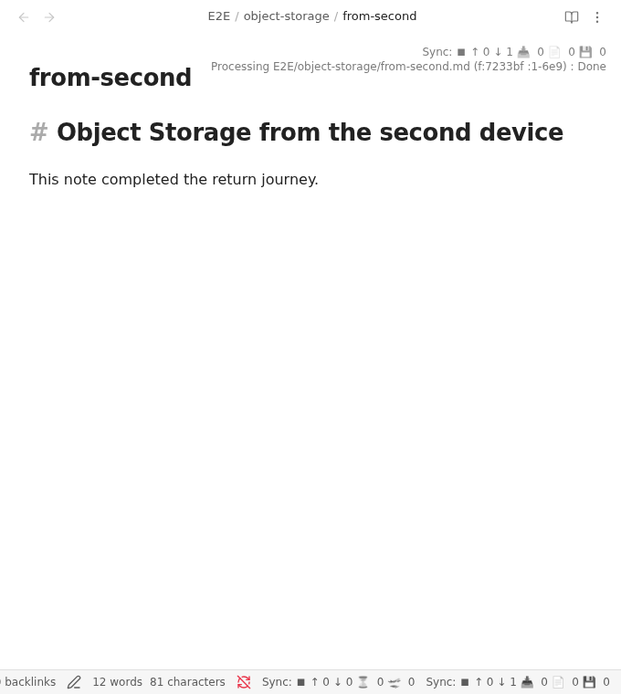

# Set up Object Storage

This guide establishes Object Storage synchronisation on a first device, generates a Setup URI for another device from that working device, and verifies synchronisation in both directions.

Object Storage uses the S3-compatible API. Prepare the following before starting:

- an HTTPS endpoint reachable by every device;
- an access key and secret key with access to the selected bucket;
- a bucket name and region;
- a unique bucket prefix when the bucket is shared; and
- separate passphrases for Vault encryption and Setup URI encryption.

Back up every Vault involved, and do not use Obsidian Sync, iCloud synchronisation, or another synchronisation service on the same Vault.

## Generate the initial Setup URI

The public generator applies the Object Storage preset and records the connection as the selected remote profile. Run it from a trusted terminal:

```sh
export remote_type=s3
export endpoint=https://objects.example.com
export access_key=<ACCESS KEY>
export secret_key=<SECRET KEY>
export bucket=vault-data
export region=auto
export bucket_prefix=my-vault
export passphrase=<A STRONG VAULT ENCRYPTION PASSPHRASE>
export uri_passphrase=<A SEPARATE SETUP URI PASSPHRASE>
deno run --minimum-dependency-age=0 --allow-env https://raw.githubusercontent.com/vrtmrz/obsidian-livesync/main/utils/setup/generate_setup_uri.ts
```

For providers which require them, set `force_path_style`, `use_custom_request_handler`, or `bucket_custom_headers` as described in the [setup utility reference](../utils/readme.md#object-storage).

Store the generated Setup URI and Setup URI passphrase separately. The URI is encrypted, but it contains the Object Storage credentials.

## Set up the first device

Use a new bucket prefix, or a prefix whose contents you deliberately intend to replace.

1. Install and enable Self-hosted LiveSync in the intended Vault.
2. Open onboarding from the `Welcome to Self-hosted LiveSync` Notice.
3. Select `I am setting this up for the first time`, then choose the recommended Setup URI method.
4. Paste the initial Setup URI, enter its passphrase, and select `Test Settings and Continue`.

    

5. Select `Restart and Initialise Server`, then read and accept the final overwrite confirmation only when this Vault is the intended source of truth.

    

    

6. A new prefix may show `Fetch Remote Configuration Failed` because it has no saved configuration. Select `Skip and proceed` only for a genuinely new prefix. Otherwise, stop and check the endpoint, credentials, bucket, and prefix.

    

7. Keep optional features disabled until ordinary note synchronisation works.
8. Create an ordinary test note, and keep Obsidian open until the LiveSync progress indicators have cleared.

## Generate the second-device Setup URI

Generate a fresh Setup URI from the working first device:

1. Run `Self-hosted LiveSync: Copy settings as a new Setup URI` from the command palette.
2. Enter a new Setup URI passphrase.

    

3. Copy the resulting URI.

    

Store this URI and its passphrase separately.

## Add another device

Start with a new or separately backed-up Vault.

1. Install and enable Self-hosted LiveSync.
2. Open onboarding, select `I am adding a device to an existing synchronisation setup`, and choose the recommended Setup URI method.
3. Enter the URI generated by the first device and its passphrase.

    

4. Select `Restart and Fetch Data`.

    

5. For a new or empty Vault, choose `Overwrite all with remote files`, then `Keep local files even if not on remote`. Review the [Fast Setup guide](./tips/fast-setup.md) before choosing a different policy for a Vault containing local work.

    

    

6. Keep Obsidian open until retrieval and file reflection finish.

Confirm that the first device's test note appears unchanged. Create a second ordinary note on the new device, wait for its journal synchronisation to finish, and confirm that it reaches the first device. Configure optional features only after this two-way check passes.





## Safety notes

- Treat the endpoint, bucket, prefix, access key, secret key, Vault passphrase, Setup URI, and Setup URI passphrase as sensitive.
- Use a distinct prefix per synchronisation set unless shared data is explicitly intended.
- Do not initialise the first device against an existing prefix unless replacing its contents is deliberate.
- Object Storage is not a Vault backup. Keep independent backups and test restoration separately.
