# Set up peer-to-peer synchronisation

This guide configures a working first device through the ordinary user interface, generates a Setup URI for an additional device, and verifies synchronisation in both directions with explicit peer approval.

Peer-to-peer synchronisation has no central data-storage server containing a copy of the Vault. A signalling relay is still required for peer discovery. The project's public signalling relay avoids the need to provision one for an ordinary setup; a controlled setup can use another Nostr-compatible relay. Vault data travels through the encrypted peer connection, not through the signalling relay.

See [How peer-to-peer synchronisation works](p2p.md) for the communication model, the public relay policy, and the distinction between signalling and TURN.

Before starting:

- back up both Vaults;
- decide whether to use the project's public signalling relay or another relay reachable by both devices;
- ensure the networks permit a WebRTC connection, or review the [P2P troubleshooting guidance](./tips/p2p-sync-tips.md);
- disable every other synchronisation service for these Vaults; and
- keep both devices awake and Obsidian open during the initial transfer.

## Set up the first device

1. Install and enable Self-hosted LiveSync in the intended Vault.
2. Open onboarding from the `Welcome to Self-hosted LiveSync` Notice.
3. Select `I am setting this up for the first time`, choose manual configuration, then select `Peer-to-Peer only`.
4. In `P2P Configuration`:
   - enable P2P;
   - select `Use the project's public signalling relay`, or enter your own signalling relay URLs;
   - generate or enter a private Group ID;
   - enter a strong P2P passphrase;
   - enter a unique name for this device; and
   - leave automatic start and automatic announcements disabled until the manual round trip succeeds.
5. Select `Test Settings and Continue`. The test joins the signalling relay; it does not require another peer to be online.
6. Complete the initialisation and final confirmation on the first device. This initialises the local LiveSync database; P2P has no central remote database to erase.

    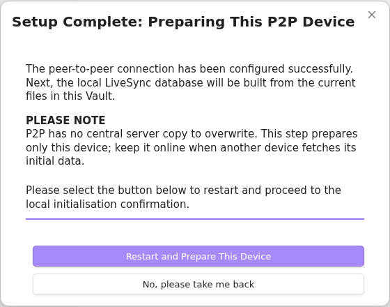

    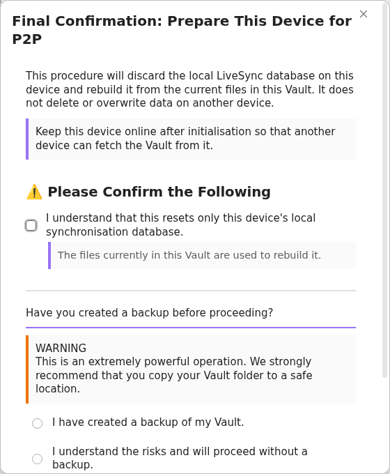

7. Keep optional features disabled until ordinary note synchronisation works.
8. Open `Self-hosted LiveSync: P2P Sync : Open P2P Status` from the command palette. After a P2P profile exists, the P2P ribbon icon provides the same destination. Select `Open connection` if signalling is disconnected.

    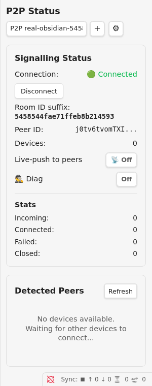

9. Create an ordinary test note and wait for the local LiveSync progress indicators to clear.

## Generate the second-device Setup URI

On the working first device:

1. Run `Self-hosted LiveSync: Copy settings as a new Setup URI` from the command palette.
2. Enter a new Setup URI passphrase.

    

3. Copy the resulting URI.

    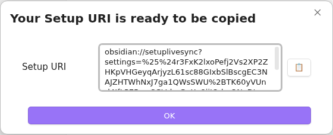

Keep the first device online. Store the new URI and its passphrase separately.

## Add the second device

1. Install and enable Self-hosted LiveSync in a new or separately backed-up Vault.
2. Open onboarding, select `I am adding a device to an existing synchronisation setup`, and choose the recommended Setup URI method.
3. Enter the Setup URI generated by the first device and its passphrase.

    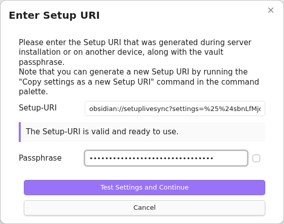

4. Select `Restart and Fetch Data`.

    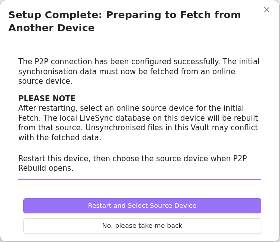

5. For a new or empty Vault, choose `Overwrite all with remote files`, then `Keep local files even if not on remote`. Review the [Fast Setup guide](./tips/fast-setup.md) before using a Vault which contains local work.

    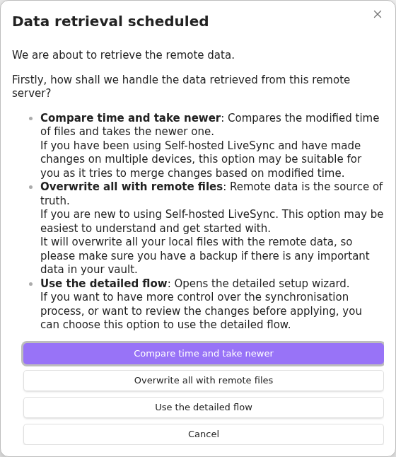

    

6. In `P2P Rebuild`, confirm that the expected name of the first device is shown, then select `Sync`.

    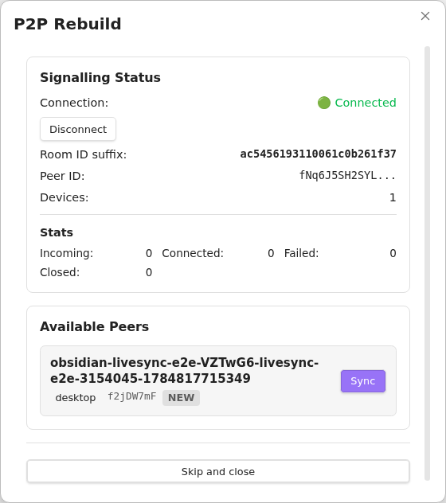

7. On the first device, verify the requesting device name and select `Accept`. Use `Accept Temporarily` instead when approval should last only for this Obsidian session.

    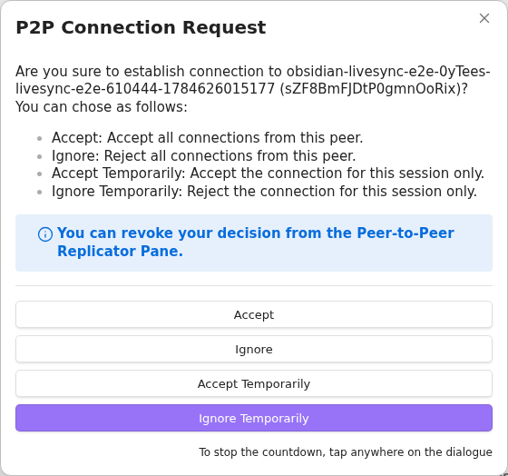

8. Keep both devices open until the test note appears on the second device.

    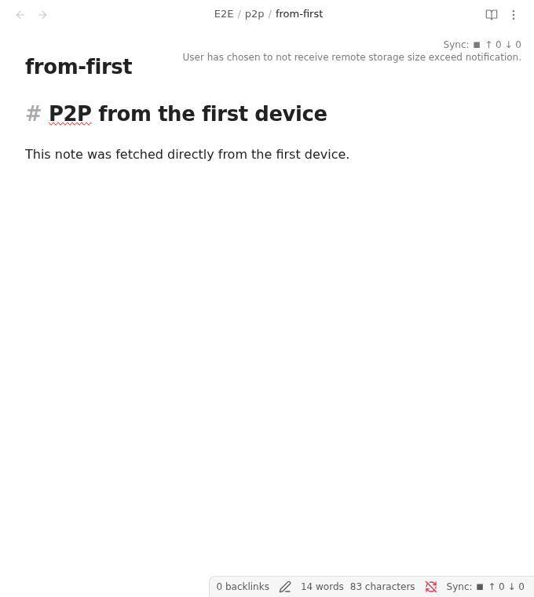

## Verify the return journey

Create a second ordinary note on the second device. Keep automatic announcements disabled, then run and verify the next synchronisation explicitly:

1. Open `P2P Status` on both devices.
2. If a peer no longer appears, select `Disconnect` and then `Open connection` on the first device, followed by the second device. The device which joins last is advertised to devices which are already in the room.
3. On the first device, select `Refresh`, verify the second-device name, then select `Replicate now`.
4. On the second device, verify the name of the requesting first device and select `Accept` or `Accept Temporarily`.

    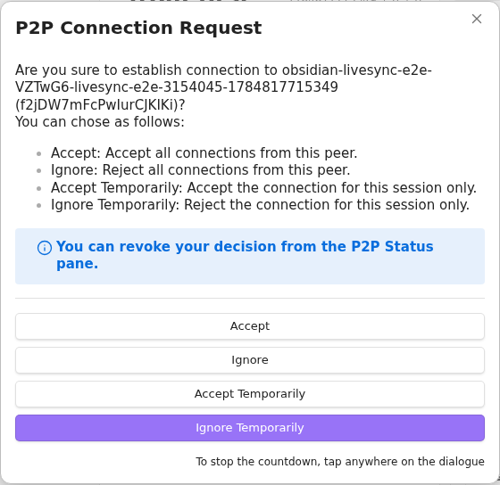

5. Confirm that the second-device note appears unchanged on the first device.

    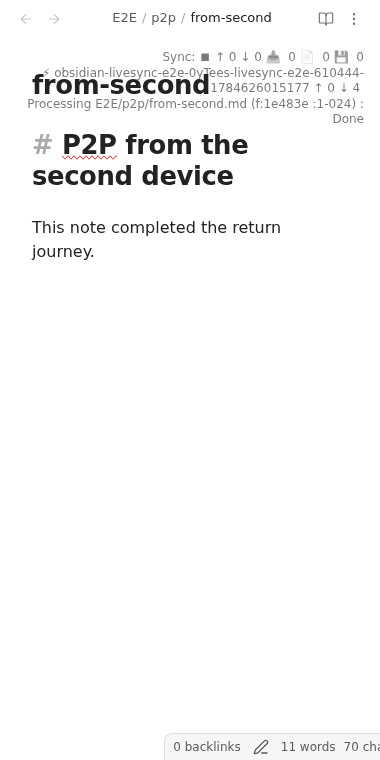

The two devices are now proven to share the same room, encryption settings, and data format in both directions.

After this manual path works, configure automatic behaviour deliberately:

- `Announce changes` on a source device dispatches change notifications while it is connected.
- `Follow changes` on the receiving device fetches after notifications from that peer.
- The peer's `More actions` menu can synchronise or follow whenever that named device connects, or include it in the P2P synchronisation command.

An announcement contains no Vault data and does not transfer a change by itself. The source must announce, the receiver must follow, and both devices must be connected.

## If a peer does not appear

- Confirm that both panes show `Connected` and the same Room ID suffix.
- Select `Refresh` after the other device joins.
- Reconnect the device which should be discovered last.
- Check that the Setup URI came from the working first device and that neither device copied a peer name manually.
- Check signalling relay reachability separately from WebRTC connectivity.
- Review VPN and TURN options in [Peer-to-Peer Synchronisation Tips](./tips/p2p-sync-tips.md).

## Controlled or self-hosted setup

The ordinary route above starts in the plug-in UI and can use the project's public signalling relay. For a controlled deployment, prepare your own Nostr-compatible relay and enter it in `Signalling relay URLs` on every device.

The public Setup URI generator is also available when configuration must be created outside Obsidian. Run it from a trusted terminal:

```sh
export remote_type=p2p
export p2p_relays=wss://relay.example.com
export p2p_room_id=<A PRIVATE ROOM ID> # Optional; generated when omitted
export p2p_passphrase=<A PRIVATE P2P PASSPHRASE> # Optional; generated when omitted
export passphrase=<A STRONG VAULT ENCRYPTION PASSPHRASE>
export uri_passphrase=<A SEPARATE SETUP URI PASSPHRASE>
deno run --minimum-dependency-age=0 --allow-env https://raw.githubusercontent.com/vrtmrz/obsidian-livesync/main/utils/setup/generate_setup_uri.ts
```

The generated Setup URI contains the encrypted room, relay, and Vault settings. It deliberately omits the device-specific name. Store the URI and its passphrase separately. After importing it on the first device, continue from the initialisation step above, then generate a fresh Setup URI for an additional device from that working device.
