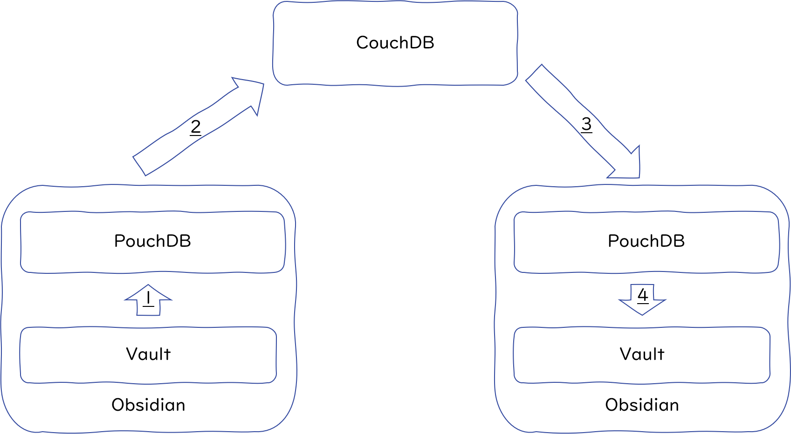
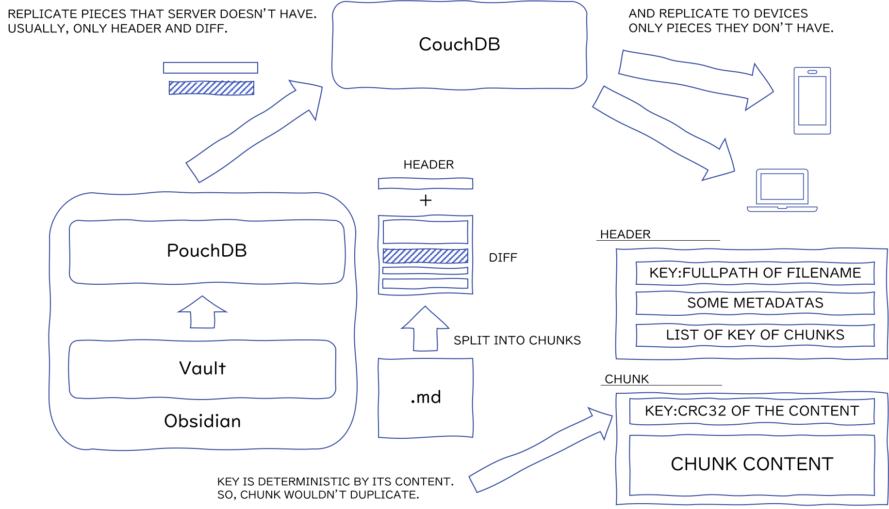

# Designed architecture

## How does this plug-in synchronise.

1. When notes are created or modified, Obsidian raises some events. Self-hosted LiveSync catches these events and reflects changes into Local PouchDB.
2. PouchDB automatically or manually replicates changes to remote CouchDB.
3. Another device is watching remote CouchDB's changes, so retrieve new changes.
4. Self-hosted LiveSync reflects replicated changeset into Obsidian's vault.

Note: The figure is drawn as single-directional, between two devices for demonstration purposes. Everything actually occurs bi-directionally between many devices at the same time.

## File events and storage writes

File events describe changes observed in the Vault. Commonlib filters and
serialises those events before updating file Metadata in the local database.
A queued `DELETE` therefore requests a database change; it is not itself an
instruction to delete the physical file. A rename out of the selected files
can also become a database deletion while the destination remains on disk.

The opposite direction starts with database Metadata. Replicated changes and
full scans can call the database-to-storage handler, which writes or removes
Vault files subject to its conflict and content-preservation rules. Preventing
a stale file event from deleting Metadata and applying a valid replicated
deletion are separate decisions.

Commonlib's [Storage events and database-to-storage reflection](https://github.com/vrtmrz/livesync-commonlib/blob/main/docs/storage-events-and-reflection.md)
documents the event boundary, the unreleased deletion revalidation, and its
limits. In particular, deletion protection does not promise full support for
external folder case changes or convergence of path spelling.

## Current technical references

- [Database Data Structures](datastructure.md) describes current Metadata and
  Chunk shapes, identifier handling, deletion, and raw remote representations.
- [Replicator architecture](design_docs/replicator_architecture.md) describes
  provider composition, active Replicator publication, retirement, and P2P
  ownership.
- [Conflict resolution and revision provenance](specs_conflict_resolution.md)
  defines the current revision-tree and file-provenance rules.
- [Chunk Retrieval and Waiting](design_docs/chunk_retrieval_and_waiting.md)
  defines missing-Chunk arrival and quiescence handling.
- [Path component length compatibility](design_docs/path_component_length_compatibility.md)
  explains why 255 UTF-8 bytes is an Android and Linux compatibility warning,
  rather than a universal rule for deciding whether a path is valid.
- [Data Compression](specs_data_compression.md) and [Garbage Collection
  V3](specs_garbage_collection.md) describe their respective storage and
  maintenance contracts.

## Techniques to keep bandwidth consumption low.

