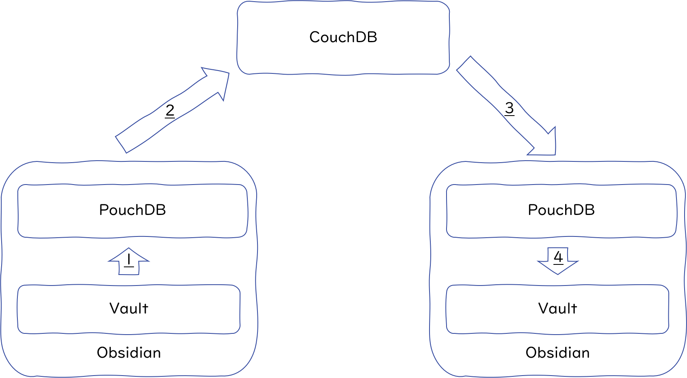
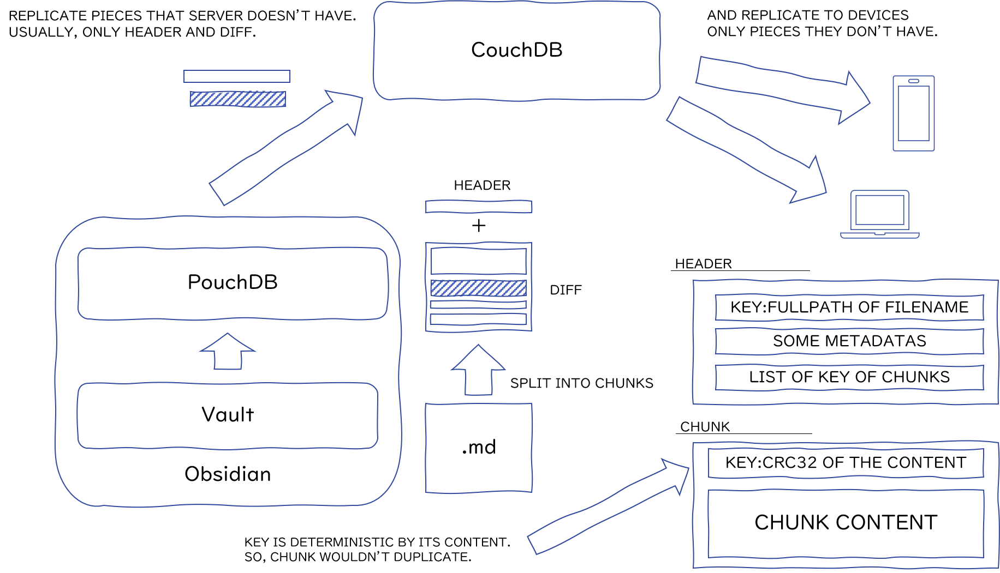

# アーキテクチャ設計

## 同期

1. ノートが更新された際、Obsidianがイベントを発報します。Obsidian-LiveSyncはそれをハンドリングして、ローカルのPouchDBに変更を反映します。
2. PouchDBは、リモートのCouchDBに差分をレプリケーションします。
3. 他のデバイスは、リモートのCouchDBを監視しているので、変更が検出された場合はそのまま差分がダウンロードされます。
4. Self-hosted LiveSyncはPouchDBに転送された変更を、ObsidianのVaultに反映していきます。

図は2端末での単一方向として描きましたが、実際には双方向に、複数の端末間で実行されます。

## 帯域幅低減のために

