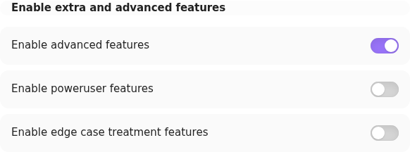
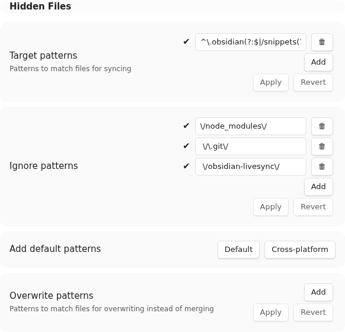
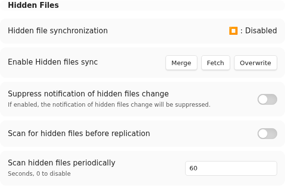

# Hidden File Sync

Hidden File Sync is an advanced, optional feature for synchronising hidden files and folders, including selected content below `.obsidian`. It is separate from ordinary note synchronisation and is deliberately left disabled during Rebuild and Fetch setup operations.

Enable it only after ordinary notes synchronise correctly in both directions on every device.

> [!WARNING]
> Hidden files can control active Obsidian settings, themes, snippets, and plug-ins. Back up every Vault before enabling this feature. Do not use Hidden File Sync and Customisation Sync to manage the same files.

## Choose the initial source

Enabling Hidden File Sync requires an initialisation direction:

- `Merge` compares the local and remote hidden-file state without declaring either side authoritative. Use this when both sides contain changes which must be retained, and review any conflicts.
- `Fetch` treats the remote hidden-file state as authoritative and applies it locally. Use this on an additional device after the desired files have been uploaded.
- `Overwrite` treats this device's hidden files as authoritative and writes them to the remote database. Use this first on the device whose hidden files you intend to distribute.

`Fetch` and `Overwrite` can replace files on one side. Check the direction and the backup before continuing.

## Review the file selection

1. Open Self-hosted LiveSync settings.
2. Open `Setup`, find `Enable extra and advanced features`, and enable `Advanced features`.

   

3. Open `Selector`, then review the `Hidden Files` section.
4. Use `Target patterns` to limit the feature to the hidden files you intend to synchronise. An empty target list includes every otherwise eligible hidden file.
5. Review `Ignore patterns`. The default excludes `node_modules`, `.git`, and Self-hosted LiveSync's own plug-in data. `Add default patterns` offers a `Cross-platform` set which also excludes Obsidian workspace files.

   

Prefer a narrow target list. Device-specific workspace state and another plug-in's credentials are usually poor candidates for cross-device synchronisation.

Target patterns also control directory traversal. A pattern must therefore match each parent directory as well as the intended files. For example, the following pattern admits the `.obsidian` parent and only its `snippets` subtree:

```text
^\.obsidian(?:$|/snippets(?:/|$))
```

A pattern containing only `snippets` does not admit the `.obsidian` parent, so the scan cannot reach that directory.

## Enable the first device

1. Open `Sync Settings`, then find the advanced `Hidden Files` section.

   

2. Under `Enable Hidden File Sync`, select the initialisation direction chosen above.
3. Keep Obsidian open while the initial scan and synchronisation finish.
4. Restart Obsidian when the completion Notice recommends it.
5. Confirm that the expected hidden files, and only those files, are present in the remote synchronisation state.

For the common source-of-truth rollout, select `Overwrite` on the authoritative device first.

## Enable each additional device

Hidden File Sync must be enabled independently after ordinary setup on each device.

1. Back up the additional device's Vault.
2. Apply the same target and ignore patterns.
3. Select `Fetch` if the remote hidden files are authoritative. Select `Merge` only when local hidden-file changes must also be retained.
4. Wait for the initial scan and file application to finish, then restart Obsidian if requested.
5. Verify representative files before enabling the feature on the next device.

If you later run Rebuild or Fetch as a recovery operation, expect optional features to be disabled again. Complete ordinary recovery first, then repeat this guide deliberately.

## Related settings

The [settings reference](../settings.md#7-hidden-files-advanced) describes periodic scanning, scanning before replication, notification suppression, selectors, and overwrite patterns. Change those controls only after the basic Hidden File Sync path is working.
