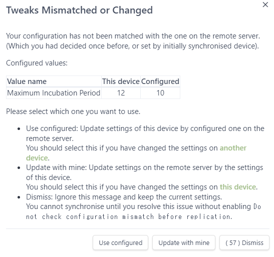
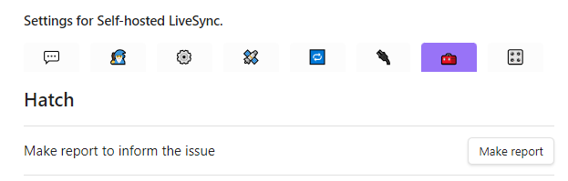
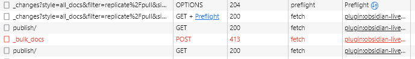
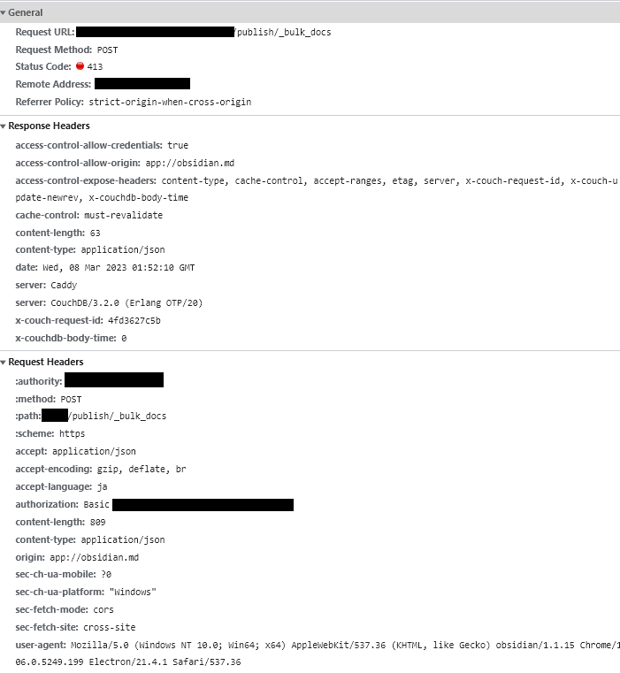

# Tips and Troubleshooting
- [Tips and Troubleshooting](#tips-and-troubleshooting)
  - [Tips](#tips)
    - [CORS avoidance](#cors-avoidance)
    - [CORS configuration with reverse proxy](#cors-configuration-with-reverse-proxy)
      - [Nginx](#nginx)
      - [Nginx and subdirectory](#nginx-and-subdirectory)
      - [Caddy](#caddy)
      - [Caddy and subdirectory](#caddy-and-subdirectory)
      - [Apache](#apache)
    - [Show all setting panes](#show-all-setting-panes)
    - [How to resolve `Tweaks Mismatched of Changed`](#how-to-resolve-tweaks-mismatched-of-changed)
  - [Notable bugs and fixes](#notable-bugs-and-fixes)
    - [Binary files get bigger on iOS](#binary-files-get-bigger-on-ios)
    - [Some setting name has been changed](#some-setting-name-has-been-changed)
  - [Questions and Answers](#questions-and-answers)
    - [How should I share the settings between multiple devices?](#how-should-i-share-the-settings-between-multiple-devices)
    - [What should I enter for the passphrase of Setup-URI?](#what-should-i-enter-for-the-passphrase-of-setup-uri)
    - [Why the settings of Self-hosted LiveSync itself is disabled in default?](#why-the-settings-of-self-hosted-livesync-itself-is-disabled-in-default)
    - [The plug-in says `something went wrong`.](#the-plug-in-says-something-went-wrong)
    - [A large number of files were deleted, and were synchronised!](#a-large-number-of-files-were-deleted-and-were-synchronised)
    - [Why `Use an old adapter for compatibility` is somehow enabled in my vault?](#why-use-an-old-adapter-for-compatibility-is-somehow-enabled-in-my-vault)
    - [ZIP (or any extensions) files were not synchronised. Why?](#zip-or-any-extensions-files-were-not-synchronised-why)
    - [I hope to report the issue, but you said you needs `Report`. How to make it?](#i-hope-to-report-the-issue-but-you-said-you-needs-report-how-to-make-it)
    - [Where can I check the log?](#where-can-i-check-the-log)
    - [Why are the logs volatile and ephemeral?](#why-are-the-logs-volatile-and-ephemeral)
    - [Some network logs are not written into the file.](#some-network-logs-are-not-written-into-the-file)
    - [If a file were deleted or trimmed, the capacity of the database should be reduced, right?](#if-a-file-were-deleted-or-trimmed-the-capacity-of-the-database-should-be-reduced-right)
    - [How to launch the DevTools](#how-to-launch-the-devtools)
      - [On Desktop Devices](#on-desktop-devices)
      - [On Android](#on-android)
      - [On iOS, iPadOS devices](#on-ios-ipados-devices)
    - [How can I use the DevTools?](#how-can-i-use-the-devtools)
      - [Checking the network log](#checking-the-network-log)
  - [Troubleshooting](#troubleshooting)
    - [While using Cloudflare Tunnels, often Obsidian API fallback and `524` error occurs.](#while-using-cloudflare-tunnels-often-obsidian-api-fallback-and-524-error-occurs)
    - [On the mobile device, cannot synchronise on the local network!](#on-the-mobile-device-cannot-synchronise-on-the-local-network)
    - [I think that something bad happening on the vault...](#i-think-that-something-bad-happening-on-the-vault)
    - [Flag Files](#flag-files)
    - [Old tips](#old-tips)

<!-- - -->

## Tips

### CORS avoidance

If we are unable to configure CORS properly for any reason (for example, if we cannot configure non-administered network devices), we may choose to ignore CORS.
To use the Obsidian API (also known as the Non-Native API) to bypass CORS, we can enable the toggle ``Use Request API to avoid `inevitable` CORS problem``.

<!-- Add **Long explanation of CORS** here for integrity -->

### CORS configuration with reverse proxy

- IMPORTANT: CouchDB handles CORS by itself. Do not process CORS on the reverse
  proxy.
    - Do not process `Option` requests on the reverse proxy!
    - Make sure `host` and `X-Forwarded-For` headers are forwarded to the CouchDB.
    - If you are using a subdirectory, make sure to handle it properly. More
      detailed information is in the
      [CouchDB documentation](https://docs.couchdb.org/en/stable/best-practices/reverse-proxies.html).

Minimal configurations are as follows:

#### Nginx

```nginx
location / {
    proxy_pass http://localhost:5984;
    proxy_redirect off;
    proxy_buffering off;
    proxy_set_header Host $host;
    proxy_set_header X-Forwarded-For $proxy_add_x_forwarded_for;
}
```

#### Nginx and subdirectory

```nginx
location /couchdb {
    rewrite ^ $request_uri;
    rewrite ^/couchdb/(.*) /$1 break;
    proxy_pass http://localhost:5984$uri;
    proxy_redirect off;
    proxy_buffering off;
    proxy_set_header Host $host;
    proxy_set_header X-Forwarded-For $proxy_add_x_forwarded_for;
}

location /_session {
    proxy_pass http://localhost:5984/_session;
    proxy_redirect off;
    proxy_buffering off;
    proxy_set_header Host $host;
    proxy_set_header X-Forwarded-For $proxy_add_x_forwarded_for;
}
```

#### Caddy

```caddyfile
domain.com {
   reverse_proxy localhost:5984
}
```

#### Caddy and subdirectory

```caddyfile
domain.com {
    reverse_proxy /couchdb/* localhost:5984
    reverse_proxy /_session/* localhost:5984/_session
}
```

#### Apache

Sorry, Apache is not recommended for CouchDB. Omit the configuration from here.
Please refer to the
[Official documentation](https://docs.couchdb.org/en/stable/best-practices/reverse-proxies.html#reverse-proxying-with-apache-http-server).

### Show all setting panes

Full pane is not shown by default. To show all panes, please toggle all in
`🧙‍♂️ Wizard` -> `Enable extra and advanced features`.

For your information, the all panes are as follows:


### How to resolve `Tweaks Mismatched of Changed`

(Since v0.23.17)

If you have changed some configurations or tweaks which should be unified
between the devices, you will be asked how to reflect (or not) other devices at
the next synchronisation. It also occurs on the device itself, where changes are
made, to prevent unexpected configuration changes from unwanted propagation.\
(We may thank this behaviour if we have synchronised or backed up and restored
Self-hosted LiveSync. At least, for me so).

Following dialogue will be shown: 

- If we want to propagate the setting of the device, we should choose
  `Update with mine`.
- On other devices, we should choose `Use configured` to accept and use the
  configured configuration.
- `Dismiss` can postpone a decision. However, we cannot synchronise until we
  have decided.

Rest assured that in most cases we can choose `Use configured`. (Unless you are
certain that you have not changed the configuration).

If we see it for the first time, it reflects the settings of the device that has
been synchronised with the remote for the first time since the upgrade.
Probably, we can accept that.

<!-- Add here -->

## Notable bugs and fixes

### Binary files get bigger on iOS

- Reported at: v0.20.x
- Fixed at: v0.21.2 (Fixed but not reviewed)
- Required action: larger files will not be fixed automatically, please perform
  `Verify and repair all files`. If our local database and storage are not
  matched, we will be asked to apply which one.

### Some setting name has been changed

- Fixed at: v0.22.6

| Previous name                | New name                                 |
| ---------------------------- | ---------------------------------------- |
| Open setup URI               | Use the copied setup URI                 |
| Copy setup URI               | Copy current settings as a new setup URI |
| Setup Wizard                 | Minimal Setup                            |
| Check database configuration | Check and Fix database configuration     |

## Questions and Answers

### How should I share the settings between multiple devices?

- Device setup:
    - Using `Setup URI` is the most straightforward way.
- Setting changes during use:
    - Use `Sync settings via Markdown files` on the `🔄️ Sync settings` pane.

### What should I enter for the passphrase of Setup-URI?

- Anything you like is OK. However, the recommendation is as follows:
    - Include the vault (group) information.
    - Include the date of operation.
    - Anything random for your security.
    - For example, `MyVault-20240901-r4nd0mStr1ng`.
- Why?
    - The Setup-URI is encoded; that means it cannot indicate the actual settings. Hence, if you use the same passphrase for multiple vaults, you may accidentally mix up vaults.

### Why the settings of Self-hosted LiveSync itself is disabled in default?

Basically, if we configure all `additionalSuffixOfDatabaseName` the same, we can synchronise this file between multiple devices.
(`additionalSuffixOfDatabaseName` should be unique in each device, not in the synchronised vaults).
However, if we synchronise the settings of Self-hosted LiveSync itself, we may encounter some unexpected behaviours.
For example, if a setting that 'let Self-hosted LiveSync setting be excluded' is synced, it is very unlikely that things will recover automatically after this, and there is little chance we will even notice this. Even if we change our minds and change the settings back on other devices. It could get even worse if incompatible changes are automatically reflected; everything will break.

### The plug-in says `something went wrong`.

There are many cases where this is really unclear. One possibility is that the chunk fetch did not go well.

1. Restarting Obsidian sometimes helps (fetch-order problem).
2. If actually there are no chunks, please perform `Recreate missing chunks for all files` on the `🧰 Hatch` pane at the other devices. And synchronise again. (also restart Obsidian may effect).
3. If the problem persists, please perform `Verify and repair all files` on the `🧰 Hatch` pane. If our local database and storage are not matched, we will be asked to apply which one.

### A large number of files were deleted, and were synchronised!

1. Backup everything important.
    - Your local vault.
    - Your CouchDB database (this can be done by replicating to another database).
2. Prepare the empty vault
3. Place `redflag.md` at the top of the vault.
4. Apply the settings **BUT DO NOT PROCEED TO RESTORE YET**.
     - You can use `Setup URI`, QR Code, or manually apply the settings.
5. Set `Maximum file modification time for reflected file events` in `Remediation` on the `🩹 Patches` pane.
    - If you know when the files were deleted, set the time a bit before that.
    - If not, bisecting may help us.
6. Delete `redflag.md`.
7. Perform `Reset synchronisation on This Device` on the `🎛️ Maintenance` pane.

This mode is very fragile. Please be careful.

### Why `Use an old adapter for compatibility` is somehow enabled in my vault?

Because you are a compassionate and experienced user. Before v0.17.16, we used
an old adapter for the local database. At that time, current default adapter has
not been stable. The new adapter has better performance and has a new feature
like purging. Therefore, we should use new adapters and current default is so.

However, when switching from an old adapter to a new adapter, some converting or
local database rebuilding is required, and it takes a few time. It was a long
time ago now, but we once inconvenienced everyone in a hurry when we changed the
format of our database. For these reasons, this toggle is automatically on if we
have upgraded from vault which using an old adapter.

When you rebuild everything or fetch from the remote again, you will be asked to
switch this.

Therefore, experienced users (especially those stable enough not to have to
rebuild the database) may have this toggle enabled in their Vault. Please
disable it when you have enough time.

### ZIP (or any extensions) files were not synchronised. Why?

It depends on Obsidian detects. May toggling `Detect all extensions` of
`File and links` (setting of Obsidian) will help us.

### I hope to report the issue, but you said you needs `Report`. How to make it?

We can copy the report to the clipboard, by pressing the `Make report` button on
the `Hatch` pane. 

### Where can I check the log?

We can launch the log pane by `Show log` on the command palette. And if you have
troubled something, please enable the `Verbose Log` on the `General Setting`
pane.

However, the logs would not be kept so long and cleared when restarted. If you
want to check the logs, please enable `Write logs into the file` temporarily.


> [!IMPORTANT]
>
> - Writing logs into the file will impact the performance.
> - Please make sure that you have erased all your confidential information
>   before reporting issue.

### Why are the logs volatile and ephemeral?

To avoid unexpected exposure to our confidential things.

### Some network logs are not written into the file.

Especially the CORS error will be reported as a general error to the plug-in for
security reasons. So we cannot detect and log it. We are only able to
investigate them by [Checking the network log](#checking-the-network-log).

### If a file were deleted or trimmed, the capacity of the database should be reduced, right?

No, even though if files were deleted, chunks were not deleted. Self-hosted
LiveSync splits the files into multiple chunks and transfers only newly created.
This behaviour enables us to less traffic. And, the chunks will be shared
between the files to reduce the total usage of the database.

And one more thing, we can handle the conflicts on any device even though it has
happened on other devices. This means that conflicts will happen in the past,
after the time we have synchronised. Hence we cannot collect and delete the
unused chunks even though if we are not currently referenced.

To shrink the database size, `Rebuild everything` only reliably and effectively.
But do not worry, if we have synchronised well. We have the actual and real
files. Only it takes a bit of time and traffics.

### How to launch the DevTools

#### On Desktop Devices

We can launch the DevTools by pressing `ctrl`+`shift`+`i` (`Command`+`shift`+`i` on Mac).

#### On Android

Please refer to [Remote debug Android devices](https://developer.chrome.com/docs/devtools/remote-debugging/).
Once the DevTools have been launched, everything operates the same as on a PC.

#### On iOS, iPadOS devices

If we have a Mac, we can inspect from Safari on the Mac. Please refer to [Inspecting iOS and iPadOS](https://developer.apple.com/documentation/safari-developer-tools/inspecting-ios).

### How can I use the DevTools?

#### Checking the network log

1. Open the network pane.
2. Find the requests marked in red.\
   
3. Capture the `Headers`, `Payload`, and, `Response`. **Please be sure to keep
   important information confidential**. If the `Response` contains secrets, you
   can omitted that. Note: Headers contains a some credentials. **The path of
   the request URL, Remote Address, authority, and authorization must be
   concealed.**\
   

## Troubleshooting

<!-- Add here -->

### While using Cloudflare Tunnels, often Obsidian API fallback and `524` error occurs.

A `524` error occurs when the request to the server is not completed within a
`specified time`. This is a timeout error from Cloudflare. From the reported
issue, it seems to be 100 seconds. (#627).

Therefore, this error returns from Cloudflare, not from the server. Hence, the
result contains no CORS field. It means that this response makes the Obsidian
API fallback.

However, even if the Obsidian API fallback occurs, the request is still not
completed within the `specified time`, 100 seconds.

To solve this issue, we need to configure the timeout settings.

Please enable the toggle in `💪 Power users` -> `CouchDB Connection Tweak` ->
`Use timeouts instead of heartbeats`.

### On the mobile device, cannot synchronise on the local network!

Obsidian mobile is not able to connect to the non-secure end-point, such as
starting with `http://`. Make sure your URI of CouchDB. Also not able to use a
self-signed certificate.

### I think that something bad happening on the vault...

Place the [flag file](#flag-files) on top of the vault, and restart Obsidian. The most simple
way is to create a new note and rename it to `redflag`. Of course, we can put it
without Obsidian.

For example, if there is `redflag.md`, Self-hosted LiveSync suspends all database and storage
processes.

### Flag Files

The flag file is a simple Markdown file designed to prevent storage events and database events in self-hosted LiveSync.
Its very existence is significant; it may be left blank, or it may contain text; either is acceptable.

This file is in Markdown format so that it can be placed in the Vault externally, even if Obsidian fails to launch.

There are some options to use `redflag.md`.

| Filename      | Human-Friendly Name | Description                                                                          |
| ------------- | ------------------- | ------------------------------------------------------------------------------------ |
| `redflag.md`  | -                   | Suspends all processes.                                                              |
| `redflag2.md` | `flag_rebuild.md`   | Suspends all processes, and rebuild both local and remote databases by local files.  |
| `redflag3.md` | `flag_fetch.md`     | Suspends all processes, discard the local database, and fetch from the remote again. |

When fetching everything remotely or performing a rebuild, restarting Obsidian
is performed once for safety reasons. At that time, Self-hosted LiveSync uses
these files to determine whether the process should be carried out. (The use of
normal markdown files is a trick to externally force cancellation in the event
of faults in the rebuild or fetch function itself, especially on mobile
devices). This mechanism is also used for set-up. And just for information,
these files are also not subject to synchronisation.

However, occasionally the deletion of files may fail. This should generally work
normally after restarting Obsidian. (As far as I can observe).

### Old tips

- Rarely, a file in the database could be corrupted. The plugin will not write
  to local storage when a file looks corrupted. If a local version of the file
  is on your device, the corruption could be fixed by editing the local file and
  synchronizing it. But if the file does not exist on any of your devices, then
  it can not be rescued. In this case, you can delete these items from the
  settings dialog.
- To stop the boot-up sequence (eg. for fixing problems on databases), you can
  put a `redflag.md` file (or directory) at the root of your vault. Tip for iOS:
  a redflag directory can be created at the root of the vault using the File
  application.
- Also, with `redflag2.md` placed, we can automatically rebuild both the local
  and the remote databases during the boot-up sequence. With `redflag3.md`, we
  can discard only the local database and fetch from the remote again.
- Q: The database is growing, how can I shrink it down? A: each of the docs is
  saved with their past 100 revisions for detecting and resolving conflicts.
  Picturing that one device has been offline for a while, and comes online
  again. The device has to compare its notes with the remotely saved ones. If
  there exists a historic revision in which the note used to be identical, it
  could be updated safely (like git fast-forward). Even if that is not in
  revision histories, we only have to check the differences after the revision
  that both devices commonly have. This is like git's conflict-resolving method.
  So, We have to make the database again like an enlarged git repo if you want
  to solve the root of the problem.
- And more technical Information is in the [Technical Information](tech_info.md)
- If you want to synchronize files without obsidian, you can use
  [filesystem-livesync](https://github.com/vrtmrz/filesystem-livesync).
- WebClipper is also available on Chrome Web
  Store:[obsidian-livesync-webclip](https://chrome.google.com/webstore/detail/obsidian-livesync-webclip/jfpaflmpckblieefkegjncjoceapakdf)

Repo is here:
[obsidian-livesync-webclip](https://github.com/vrtmrz/obsidian-livesync-webclip).
(Docs are a work in progress.)
