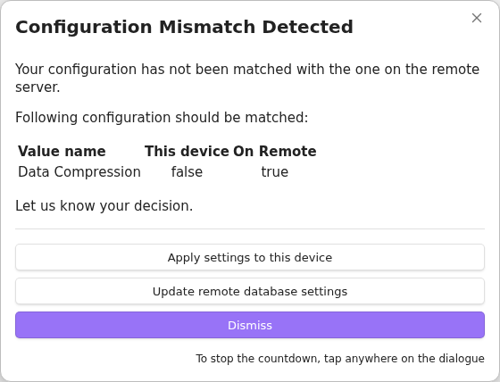
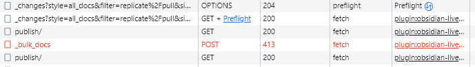
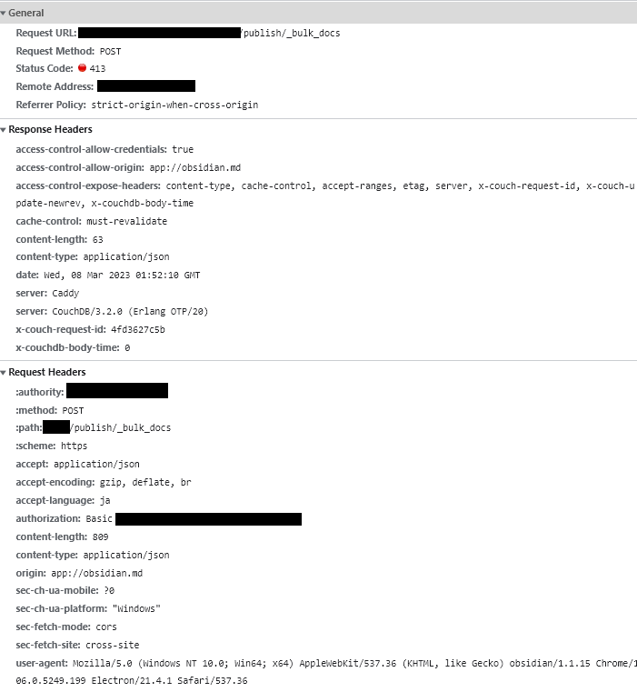

# Troubleshooting

Start with the symptom which is visible now. Do not reset a database, change transport, or enable P2P merely to see whether the problem disappears.

> [!IMPORTANT]
> If Obsidian will not start, do not give up. Close it, create `redflag.md` at the Vault root with the operating system's file manager, then follow [Recovery and flag files](recovery.md). This is the supported route for intervening before ordinary LiveSync start-up work.

Before changing settings:

1. Back up the affected Vaults and, where possible, the remote database or bucket.
2. Stop editing on other devices.
3. Confirm that every participating device uses the intended plug-in version.
4. Identify whether the active main remote is CouchDB, Object Storage, or P2P.
5. Open `Show log` and note the first error, rather than only the final summary.

For a report, run `Generate full report for opening the issue with debug info`, remove credentials and private server details, and include the steps which caused the symptom.

## CouchDB does not connect

Check the connection in this order:

1. Confirm that the URL is complete and points to the intended server.
2. On mobile, use HTTPS with a certificate trusted by the operating system. Plain HTTP and self-signed certificates are not supported.
3. Confirm the username, password, database name, and any custom headers.
4. Confirm that the server responds outside the plug-in and that the database exists on additional devices.
5. Use the setup dialogue's connection test.
6. If basic access works, run **Check server requirements**. Its initial check is read-only. Each offered server change requires separate confirmation.

Configure CouchDB CORS first. Reverse-proxy examples belong in [Set up your own CouchDB server](setup_own_server.md), alongside the rest of the server configuration.

`Use Internal API` is a compatibility workaround for a trusted server. It sends the configured credentials through Obsidian's internal request API. Enable it only after checking the destination, and do not treat a fallback through that API as proof that the server or proxy is correctly configured.

A Cloudflare `524` response means that Cloudflare timed out while waiting for the origin. The response may also lack the CORS headers which would have been present on an ordinary CouchDB response. Correct the long-running server or proxy request first. The advanced CouchDB option `Use timeouts instead of heartbeats` may help only when the underlying operation is otherwise healthy.

For JWT-specific setup and key-format errors, see [JWT Authentication on CouchDB](tips/jwt-on-couchdb.md).

## CouchDB was working but synchronisation stopped

Do not switch to P2P or reset the database as the first response. Check:

1. the active remote profile and connection state;
2. the plug-in version on every device;
3. the CouchDB response and server logs;
4. pending LiveSync progress indicators;
5. `Check server requirements`; and
6. the LiveSync log and full report.

If the remote is healthy but one device's local database is not, use [Reset Synchronisation on This Device](recovery.md#reset-synchronisation-on-this-device) only after backing up unsynchronised local files.

## Files are missing or excluded

Check Obsidian's `Detect all file extensions`, LiveSync selectors, ignore files, file-size limits, modification-time limits, and Hidden File Sync rules. A filtered file is different from a file which reached the database but could not be reconstructed from its chunks.

If the log reports missing chunks or a size mismatch:

1. stop editing the affected file and keep a separate copy of any readable content;
2. restart Obsidian once to rule out an interrupted fetch;
3. synchronise a device or restore a backup which still has the correct content;
4. on that healthy device, run `Recreate chunks for current Vault files`, then synchronise;
5. run `Verify and repair all files` from `Hatch`; review the winner, every conflict revision, and any unavailable shared ancestor separately; and
6. use `Discard unreadable revision` only after confirming that the exact revision is no longer recoverable or wanted.

`Retry reading revision` does not change the revision tree. `Discard unreadable revision` creates a logical deletion for one current winner or conflict revision after rechecking it. It does not purge history or reconstruct missing content. An unavailable non-live ancestor cannot be deleted through this workflow; it disables conservative three-way merge but does not prevent explicit selection between readable live revisions.

`Recreate chunks for current Vault files` uses current Vault content. It cannot recreate unique bytes which exist only in an unreadable historical or conflict revision.

## A configuration mismatch dialogue blocks synchronisation

Some settings must match across devices. LiveSync pauses synchronisation when the local and remote values differ rather than propagating an unexpected change silently.

Current releases automatically align compatible settings which control how new chunks are created, by default and where possible. This applies to the chunk hash algorithm, chunk size, and splitter version. Existing content remains readable across these choices, although using different choices can reduce chunk reuse and increase storage or transfer work. An explicit opt-out retains the manual review. A mismatch involving encryption, path obfuscation, file-name case handling, or any combination which includes one of those settings always remains a manual decision.

The available actions depend on when the mismatch is found:

- While checking a remote profile, `Use configured settings` accepts the shared values already stored in that remote. `Dismiss` leaves this device's settings unchanged.
- For a mismatch found before synchronisation, `Apply settings to this device` accepts the remote values. Choose `Update remote database settings` only when this device's values are intended to become the shared values.
- When the change requires local or remote reconstruction, the action itself states that Fetch or Rebuild will follow. Make sure that the intended authoritative copy is available before choosing it.
- `Dismiss` postpones a mismatch found before synchronisation. Synchronisation remains paused until the mismatch is resolved.

Historic defect notices and renamed controls are retained in the [0.25 release history](releases/0.25.md) and [legacy release history](releases/legacy.md), rather than in the current troubleshooting path.

## Setup and settings questions

### Share a configuration with another device

Generate an encrypted Setup URI from a working device. This preserves the intended remote profiles and selections while allowing the additional device to keep its own device-specific name. Store the URI and its passphrase separately.

For deliberate setting changes during normal use, use `Sync Settings via Markdown` under `Sync settings`.

### Choose a Setup URI passphrase

Use a strong passphrase which is distinct from the Vault encryption passphrase. Record enough context outside the encrypted URI to identify the intended Vault and date, but do not rely on a reused human-readable pattern alone.

### Why synchronising LiveSync's own settings is disabled by default

An automatically propagated transport, database, or exclusion setting can disable the mechanism needed to reverse it. LiveSync therefore keeps its own settings out of Customisation Sync by default. Enable that advanced behaviour only with an independent recovery path and device-specific database suffixes.

### The plug-in reports that something went wrong

Use the first specific error in `Show log` to choose the relevant section. When it names chunks or a size mismatch, follow [Files are missing or excluded](#files-are-missing-or-excluded). Do not rebuild solely from the generic final message.

### A large deletion propagated

Stop every device, preserve the available copies, and follow [Recovery and flag files](recovery.md). If the deletion time is known, `Maximum file modification time for reflected file events` under `Remediation` can limit which remote events are applied while recovering into a separate, backed-up Vault. Treat that as a forensic recovery constraint, not as an ordinary synchronisation setting.

### An old database adapter is still selected

Very old Vaults may retain the compatibility adapter until a deliberate local database migration or reset. Do not toggle it merely to troubleshoot an unrelated current failure. The history and migration notes are in the [legacy release history](releases/legacy.md).

### ZIP or another extension is not synchronised

Enable Obsidian's `Detect all file extensions`, then check LiveSync selectors, ignore rules, and size limits as described in [Files are missing or excluded](#files-are-missing-or-excluded).

## Collect a report

Run `Generate full report for opening the issue with debug info` to copy the current settings summary and recent verbose log lines. Remove credentials, remote URLs, Vault names, file contents, and other private information before sharing it.

When a problem concerns one file, run **Copy database information for the active file**, or use **Hatch** → **Copy database information for a file** to select another file. The report describes this device's local database view, including the Vault-relative path, document and chunk identifiers, local database revisions, conflicts, and local chunk availability. It does not query the remote server or include file contents. Treat paths and identifiers as private metadata before sharing.

Use `Show log` for live inspection. Logs are intentionally kept in memory for a limited time to reduce accidental disclosure. Enable `Write logs into the file` only while reproducing a problem, then disable it and remove the file after review because persistent logging affects performance and may contain private data.

Browser security errors, particularly CORS failures, may reach the plug-in only as a general network error. Use the network inspector when the ordinary log cannot show the rejected response.

## The database remains large after files are deleted

LiveSync stores file metadata, chunks, revision history, conflicts, deletions, and tombstones. Deleting or shortening a file therefore does not immediately remove every object which once represented it.

Garbage Collection can remove unreferenced chunks, but it is appropriate only when the Vault and local database are healthy and all relevant devices have synchronised. Tombstones and retained revisions are not free, so Garbage Collection does not guarantee a minimal database.

`Overwrite Server Data with This Device's Files` is a separate rebuild operation and is the more certain way to reconstruct a central remote from a chosen authoritative Vault. It is also destructive and may discard changes which exist only on another device. Review [Recovery and flag files](recovery.md#garbage-collection-is-not-rebuild) before choosing between them.

## Inspect a network failure

### Desktop

Open Developer Tools with `Ctrl`+`Shift`+`I`, or `Command`+`Option`+`I` on macOS.

### Android

Follow Chrome's [Remote debug Android devices](https://developer.chrome.com/docs/devtools/remote-debugging/) guide.

### iOS and iPadOS

Use Safari on a Mac and follow Apple's [Inspecting iOS and iPadOS](https://developer.apple.com/documentation/safari-developer-tools/inspecting-ios) guide.

### Network evidence

1. Open the network pane.
2. Reproduce the failure and select the request marked in red.
   
3. Record the status, timing, and a sanitised version of the headers, payload, and response.
4. Remove the request path, remote address, authority, authorisation, cookies, credentials, and response secrets before sharing.

   

## P2P does not connect or transfer changes

Use [Peer-to-Peer Synchronisation Tips](tips/p2p-sync-tips.md). Check signalling discovery separately from the WebRTC data path, and confirm which devices announce and follow changes. P2P is not a repair step for another transport.

## Obsidian or LiveSync remains suspended

Follow [Recovery and flag files](recovery.md). A `redflag.md` emergency stop remains active until it is removed outside Obsidian. Fetch and rebuild flags have different, potentially destructive meanings; do not create them merely to clear a warning.

## Further technical context

See [Technical Information](tech_info.md) for database and synchronisation internals. Current behaviour belongs in this guide; instructions for older defects remain in the release histories.
