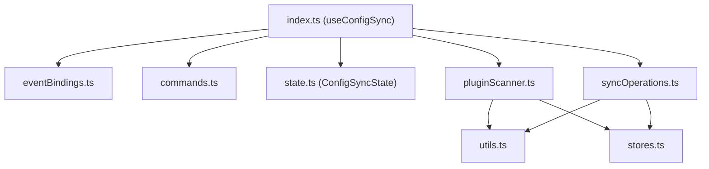

# Configuration Synchronisation (`configSync`)

This module manages the synchronisation of Obsidian configurations, particularly plug-in lists, plug-in manifests, and plug-in data (such as settings JSON files). It refactors the monolithic implementation of `CmdConfigSync.ts` into a set of decoupled, side-effect-free, and highly testable functions.

## Module Structure

The feature consists of the following components:

- **`index.ts`**: The entry point that defines the `useConfigSync` service feature, initialising the state and wiring up events and commands.
- **`types.ts`**: Defines the services required from the global `ServiceHub` (`ConfigSyncServices`), required `ServiceModules`, and the host interface.
- **`state.ts`**: Encapsulates all mutable runtime states (e.g. processor references, cached manifest modification times, and UI dialogue references) inside a single state object.
- **`stores.ts`**: Provides Svelte stores for plug-in lists, enumeration status, and manifest caches to bind reactivity to the UI.
- **`utils.ts`**: Delimiter-based serialisation/deserialisation utilities, target path detection, unified key transformations, and general configuration mapping functions.
- **`pluginScanner.ts`**: Scans the vault for installed plug-ins, parses manifests, detects active states, and updates Svelte stores.
- **`syncOperations.ts`**: Implements synchronisation tasks including comparing local plug-in configurations with the database, downloading/uploading configurations, and watching vault events.
- **`eventBindings.ts`**: Registers event handlers to Obsidian and other internal services (e.g., reacting to plug-in lifecycle events).
- **`commands.ts`**: Registers ribbon commands and command palette items (e.g., opening the plugin synchronisation dialogue).

## Key Workflows

### Plug-in Scanning & Enumeration
1. Scans the `.obsidian/plugins/` directory to discover all installed plug-ins.
2. Reads and parses their `manifest.json` files and caches the results in `pluginManifests`.
3. Checks which plug-ins are currently enabled or disabled.
4. Aggregates this information into `pluginList` for UI dialogues.

### Configuration Synchronisation (Upload and Download)
1. Fetches configuration changes from the remote database or checks local settings files.
2. Converts filepath configurations to unified key formats (e.g. prefixing with `ix:`, stripping system-specific paths).
3. Detects modifications using hash and modification time (`mtime`) comparisons.
4. Performs silent or interactive updates depending on the user's setting, applying configuration files back to the storage and triggering hot-reloading if necessary.

### Real-time Event Monitoring
1. Observes file changes in configuration directories using Obsidian vault events.
2. Hooks into plug-in activation/deactivation events to trigger synchronisation sweeps automatically.
