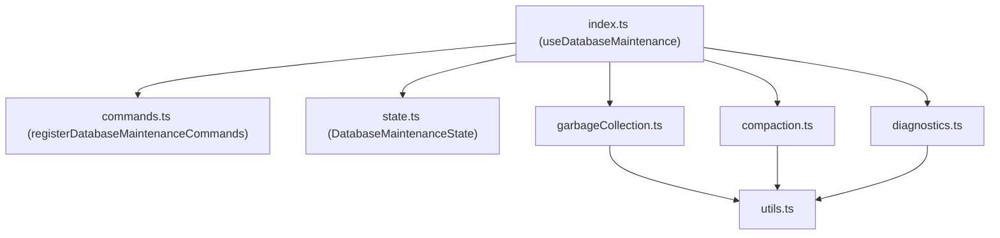

# Database Maintenance (`databaseMaintenance`)

This module manages database maintenance operations, including garbage collection of unused chunks, remote database compaction, and database usage diagnostics. It refactors the monolithic implementation of `CmdLocalDatabaseMainte.ts` into a set of decoupled, side-effect-free, and highly testable functions.

## Module Structure

The feature consists of the following components:

- **`index.ts`**: The entry point that defines the `useDatabaseMaintenance` service feature, initialising the state and wiring up events and commands.
- **`types.ts`**: Defines the services required from the global `ServiceHub` (`DatabaseMaintenanceServices`) and required modules.
- **`state.ts`**: Encapsulates runtime maintenance states.
- **`utils.ts`**: Common helper functions including setting availability checks (`isGCAvailable`), interactive confirmation dialogues (`confirmDialogue`), and chunk retrieval (`retrieveAllChunks`).
- **`garbageCollection.ts`**: Implements garbage collection processes, including file deletion commits, chunk deletion commits, and Garbage Collection V3 (verifying progress sync status across devices before bulk deleting).
- **`compaction.ts`**: Dispatches compaction instructions to the CouchDB instance and monitors the progress.
- **`diagnostics.ts`**: Audits database records, calculating document-to-chunk mappings and identifying orphaned chunks, copying a TSV report to the clipboard.

## Key Workflows

### Garbage Collection V3 (`gcv3`)
1. Syncs latest modifications via one-shot replication.
2. Compares progress values across all connected nodes to ensure they are synchronised.
3. Scans all active database entries to compile a set of referenced chunks.
4. Marks unused chunks as deleted (`_deleted: true`) and propagates updates to the remote database.
5. Invokes database compaction to release physical storage.

### Database Usage Audit (`analyseDatabase`)
1. Fetches all document revisions from the local database.
2. Iterates and logs chunk relationships, sorting them into unique, shared, and orphaned categories.
3. Calculates aggregated sizes and compiles details into a TSV format.
4. Prompts the user to copy the TSV string to the clipboard for external spreadsheet analysis.
