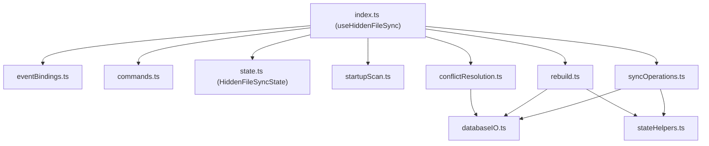

# Hidden File Synchronisation (`hiddenFileSync`)

This module manages the synchronisation of Obsidian configuration directories and files (hidden files prefixed with `.`, excluding `.trash`). It detaches the monolithic implementation of `CmdHiddenFileSync.ts` into a set of decoupled, dependency-explicit, and highly testable functions.

## Module Structure

The feature consists of the following components:

- **`index.ts`**: The entry point that defines the `useHiddenFileSync` service feature, initialising the state and wiring up events and commands.
- **`types.ts`**: Defines the services required from the global `ServiceHub` (`HiddenFileSyncServices`), required `ServiceModules`, and the `HiddenFileSyncHost` interface.
- **`state.ts`**: Encapsulates all mutable runtime states (e.g. processor references, semaphores, processed file caches) inside a single state object.
- **`stateHelpers.ts`**: Pure functions for manipulating the state, comparing modification times (`mtime`), and converting files to unique keys.
- **`databaseIO.ts`**: Side-effect functions for writing/reading database entries and storage files.
- **`syncOperations.ts`**: Core synchronisation logic (scanning storage/database, tracking modifications, and applying offline changes).
- **`rebuild.ts`**: Database re-initialisation logic (rebuilding storage from database, database from storage, or safe merging).
- **`conflictResolution.ts`**: Logic for managing conflicts on JSON and binary configuration files, showing merge dialogues, and resolving conflicts.
- **`startupScan.ts`**: Logic for checking module status and triggering the initial scan during startup.
- **`eventBindings.ts`**: Registers event handlers to Obsidian and other internal services.
- **`commands.ts`**: Registers ribbon commands and Command Palette commands.

## Key Workflows

### Storage to Database Sync (`scanAllStorageChanges`)

1. Enumerates all target hidden files in the vault.
2. Compares the current file metadata (`stat`) with the cached metadata in `state._fileInfoLastProcessed`.
3. If changes are detected, stores the updated file content in the database using chunk-based replication.

### Database to Storage Sync (`scanAllDatabaseChanges`)

1. Queries all documents in the database matching the hidden file prefix.
2. Compares the database metadata with the cached metadata in `state._databaseInfoLastProcessed`.
3. If the database entry is newer, extracts and writes the file back to the storage (and schedules Obsidian reload if configs changed).

### Merging and Conflict Resolution

- Conflict checks are enqueued into a sequential processor (`conflictResolutionProcessor`).
- If a JSON file is conflicted, a 3-way merge is attempted. If it fails, or if it is a non-JSON file, the conflict is resolved by keeping the newer modification time (`resolveByNewerEntry`) or prompting the user (`JsonResolveModal`).
