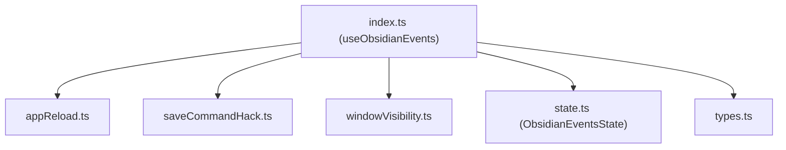

# Obsidian Events (`obsidianEvents`)

This module manages Obsidian-specific application event bindings, editor save command hijacking, window focus/visibility state transitions, and graceful application reload scheduling. It refactors the monolithic implementation of `ModuleObsidianEvents.ts` into a set of decoupled, dependency-explicit, and highly testable functions.

## Module Structure

The feature consists of the following components:

- **`index.ts`**: The entry point that defines the `useObsidianEvents` service feature, initialising the state and wiring up events and lifecycle handlers.
- **`types.ts`**: Defines the services required from the global `ServiceHub` (`ObsidianEventsServices`) and required modules.
- **`state.ts`**: Encapsulates runtime state properties including window focus status, visibility history, original save command callbacks, and active reactive processing counter streams.
- **`appReload.ts`**: Controls Obsidian application reload behaviour, providing prompts for user dialogues and a stabilised reload sequence.
- **`saveCommandHack.ts`**: Intercepts the default editor save commands to run synchronisation immediately after a document is saved.
- **`windowVisibility.ts`**: Observes visibility changes of the Obsidian document window, suspending replication channels when hidden to conserve resources and resuming them upon focus.

## Key Workflows

### Editor Save Hooking

1. Intercepts the standard `editor:save-file` command callback.
2. If `syncOnEditorSave` is enabled, schedules a deferred task to execute `replicateByEvent()`.
3. Calls the original save callback to ensure default file writing behaviour continues.

### Suspend & Resume on Window Visibility

1. Monitors window focus and DOM visibility changes (`visibilitychange`).
2. If the window is hidden and background replication is disabled, invokes `appLifecycle.onSuspending()` to pause active replication feeds.
3. Once the window becomes visible and gains focus, dispatches `onResuming()` and `onResumed()` to re-establish replication channels.

### Stabilised Application Reload

1. Instead of reloading the plug-in immediately, monitors active processing counters.
2. Combines queue counts for DB transactions, remote replications, chunk transfers, and conflict resolution processors.
3. Triggers the reload once the combined active task count stabilises at 0 for a given timeout, preventing database corruption.
